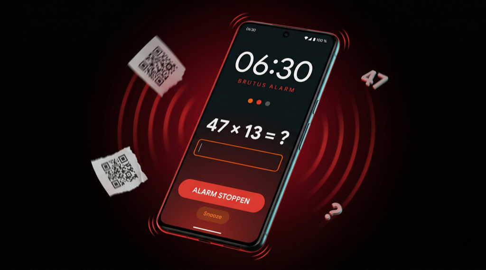
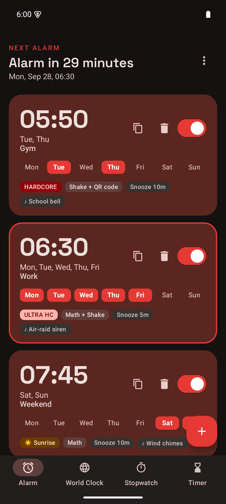
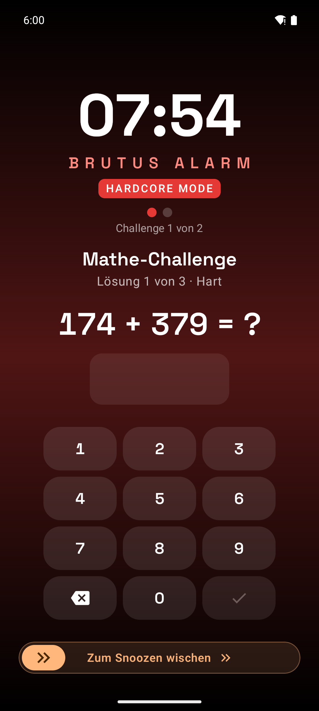
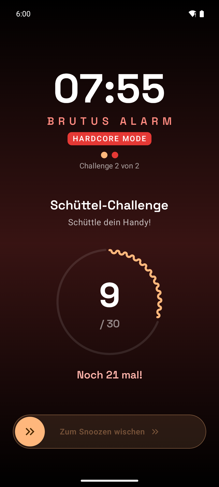

# Brutus

[English](README.md) · **Deutsch**

<p align="center">
  <a href="https://brutus.celox.io"></a>
</p>

<h2 align="center">🌐 <a href="https://brutus.celox.io">brutus.celox.io</a></h2>

<p align="center"><strong>Features, Screenshots, FAQ und die neueste signierte APK samt SHA-256 — alles auf der Produktseite.</strong></p>

<p align="center">
  <a href="https://brutus.celox.io"></a>
  &nbsp;
  <a href="https://brutus.celox.io/download"></a>
</p>

<!-- Projektstatus — diese Badges aktualisieren sich selbst. -->

[](https://github.com/pepperonas/brutus/actions/workflows/tests.yml)
[](#tests-und-ci)
[](https://github.com/pepperonas/brutus/releases/latest)
[](https://github.com/pepperonas/brutus/releases)
[](https://github.com/pepperonas/brutus/commits/main)
[](#projektstruktur)
[](https://kotlinlang.org)
[](https://github.com/pepperonas/brutus/issues)
[](https://github.com/pepperonas/brutus/stargazers)
[](LICENSE)

<!-- Plattform & Laufzeit -->

[](https://developer.android.com)
[](https://apilevels.com)
[](https://apilevels.com)
[](https://developer.android.com/tools/releases/platforms)
[](https://adoptium.net)
[](https://github.com/pepperonas/brutus/releases/latest)

<!-- Sprache, Build & Toolchain -->

[](https://kotlinlang.org)
[](https://kotlinlang.org/docs/coroutines-overview.html)
[](https://gradle.org)
[](https://developer.android.com/build)
[](https://github.com/google/ksp)
[](https://developer.android.com/build/shrink-code)

<!-- UI-Schicht -->

[](https://developer.android.com/jetpack/compose)
[](https://m3.material.io)
[](https://developer.android.com/jetpack/androidx/releases/compose-material3)
[](https://developer.android.com/jetpack/androidx/releases/navigation)
[](https://developer.android.com/reference/kotlin/androidx/compose/material/icons/package-summary)
[](THIRD_PARTY_LICENSES/SpaceGrotesk-OFL.txt)
[](#sprachen)

<!-- Daten & Geräte-APIs -->

[](https://developer.android.com/training/data-storage/room)
[](https://developer.android.com/topic/libraries/architecture/datastore)
[](https://developer.android.com/jetpack/androidx/releases/lifecycle)
[](https://developer.android.com/training/camerax)
[](https://developers.google.com/ml-kit/vision/barcode-scanning)
[](https://github.com/zxing/zxing)
[](https://developer.android.com/reference/android/app/AlarmManager#setAlarmClock)
[](https://developer.android.com/reference/android/media/AudioTrack)

<!-- Arbeitsweise -->

[](#projektstruktur)
[](https://junit.org/junit4/)
[](https://robolectric.org)
[](https://kotlinlang.org/api/kotlinx.coroutines/kotlinx-coroutines-test/)
[](https://www.conventionalcommits.org)
[](https://semver.org)
[](CHANGELOG.de.md)
[](http://makeapullrequest.com)

<!-- Was Brutus bewusst nicht tut -->

[](#berechtigungen)
[](#update-hinweis)
[](#berechtigungen)
[](#berechtigungen)
[](#berechtigungen)

> **Der Wecker, der dafür sorgt, dass du wirklich aufstehst.**

Brutus ist eine vollständige Android-Uhren-Suite — **Wecker · Weltuhr · Stoppuhr · Timer** — mit einer Mission hinter der aufgeräumten **Material-3-Expressive**-Oberfläche (tonale Flächen, räumliche Federn, wellige Fortschrittsanzeigen, Space Grotesk als Display-Schrift, Dark/Light + optionales Material You): Das Wecker-Modul zwingt dich, eine konfigurierbare Aufgabe (oder eine ganze Kette davon) zu lösen, bevor das Klingeln aufhört. Kein Schummeln, kein automatisches Ausschalten, kein Zurückschlummern.

Alles steckt in einer Bottom-Navigation mit vier Tabs, die den brutalen Wecker-Kern einen Fingertipp entfernt hält und dir trotzdem eine ordentliche Uhren-App für den Alltag gibt.

---

## Inhaltsverzeichnis

- [Screenshots](#screenshots)
- [Warum Brutus?](#warum-brutus)
- [Aufbau der App](#aufbau-der-app)
- [Funktionen](#funktionen)
  - [Kombinierbare Weck-Aufgaben](#kombinierbare-weck-aufgaben)
  - [Schwierigkeits- und Empfindlichkeits-Presets](#schwierigkeits--und-empfindlichkeits-presets)
  - [Wecker-Sounds](#wecker-sounds)
  - [Hardcore Mode](#hardcore-mode)
  - [Ultra Hardcore Mode](#ultra-hardcore-mode)
  - [Sunrise-Vorlauf](#sunrise-vorlauf)
  - [Homescreen-Widget](#homescreen-widget)
  - [Zuverlässigkeits-Banner](#zuverlässigkeits-banner)
  - [Update-Hinweis](#update-hinweis)
  - [Globaler QR-Code](#globaler-qr-code)
  - [Wisch-Geste zum Snoozen](#wisch-geste-zum-snoozen)
  - [Testmodus](#testmodus)
  - [Weltuhr](#weltuhr)
  - [Stoppuhr](#stoppuhr)
  - [Timer](#timer)
  - [Theming und Material You](#theming-und-material-you)
  - [Sprachen](#sprachen)
  - [Terminierung](#terminierung)
  - [Sperrbildschirm-Overlay](#sperrbildschirm-overlay)
  - [Zuverlässigkeit](#zuverlässigkeit)
- [Installation](#installation)
- [Berechtigungen](#berechtigungen)
- [Aus dem Quellcode bauen](#aus-dem-quellcode-bauen)
- [Release-Signatur](#release-signatur)
- [Technologie-Stack](#technologie-stack)
- [Projektstruktur](#projektstruktur)
- [Tests und CI](#tests-und-ci)
- [Wie es funktioniert](#wie-es-funktioniert)
- [Design-Philosophie](#design-philosophie)
- [Fehlerbehebung](#fehlerbehebung)
- [Roadmap](#roadmap)
- [Entwickler](#entwickler)
- [Spenden](#spenden)
- [Lizenz](#lizenz)

---

## Screenshots

> **Kommt mit dem nächsten Update.** Die Galerie unten ist fertig verdrahtet und
> wartet auf ihre zwölf Aufnahmen — welche Ansicht in welchem Zustand und mit
> welchem `adb`-Befehl, steht in
> [`docs/screenshots/SHOTLIST.de.md`](docs/screenshots/SHOTLIST.de.md). Sie liegt
> hier als Kommentar, statt zwölf kaputte Bildlinks zu zeigen.

<!-- GALLERY: uncomment once docs/screenshots/*.png exist

Aufgenommen mit **v2.2.0**, dunkles Theme, Marken-Farbschema (Material You aus). Die App gibt es auf Englisch und Deutsch — siehe [Sprachen](#sprachen).

<table>
  <tr>
    <td width="33%" valign="top">
      
      <br /><sub><b>Weckerliste</b> — Countdown-Kopfzeile, ein gedämpftes Rot für jeden aktiven Wecker, Wochentagsleiste, Chips für Modus/Aufgabe/Snooze.</sub>
    </td>
    <td width="33%" valign="top">
      
      <br /><sub><b>Bearbeiten-Sheet</b> — Zeit, Wochentage, Sound-Auswahl mit Vorhören, Aufgabenkette, Snooze-Dauer, Hardcore-Schalter.</sub>
    </td>
    <td width="33%" valign="top">
      
      <br /><sub><b>Klingelnder Wecker</b> — Vollbild über dem Sperrbildschirm, HARDCORE-Badge, kein Stopp-Knopf, bevor die Kette gelöst ist.</sub>
    </td>
  </tr>
  <tr>
    <td width="33%" valign="top">
      
      <br /><sub><b>Mathe-Challenge</b> — 1–10 generierte Aufgaben, drei Schwierigkeitsstufen, eigener Ziffernblock.</sub>
    </td>
    <td width="33%" valign="top">
      
      <br /><sub><b>Schüttel-Challenge</b> — 10–100 Schüttler gegen einen welligen Fortschrittsring, drei Empfindlichkeitsstufen.</sub>
    </td>
    <td width="33%" valign="top">
      
      <br /><sub><b>QR-Challenge</b> — CameraX-Vorschau + ML-Kit-Scanner; nur der eigene globale Code der Installation entsperrt.</sub>
    </td>
  </tr>
  <tr>
    <td width="33%" valign="top">
      
      <br /><sub><b>Weltuhr</b> — Live-Tafel über <code>java.time.ZoneId</code>, Tag-/Nacht-Farbrollen, tickt sekündlich.</sub>
    </td>
    <td width="33%" valign="top">
      
      <br /><sub><b>Stoppuhr</b> — Hundertstel-genau über <code>elapsedRealtime()</code>, Runden mit Einzel- und Gesamtspalte.</sub>
    </td>
    <td width="33%" valign="top">
      
      <br /><sub><b>Timer</b> — HMS-Picker, Schnellwahl, sanfter Endton, überlebt Tab-Wechsel.</sub>
    </td>
  </tr>
  <tr>
    <td width="33%" valign="top">
      
      <br /><sub><b>Sunrise-Vorlauf</b> — 10 Minuten Helligkeitsrampe und Morgenrot, bevor der brutale Teil beginnt.</sub>
    </td>
    <td width="33%" valign="top">
      
      <br /><sub><b>Homescreen-Widget</b> — nächste Weckzeit, Countdown und Wochentage, direkt aus derselben Room-Datenbank.</sub>
    </td>
    <td width="33%" valign="top">
      
      <br /><sub><b>Ultra-Hardcore-Aufgabe</b> — 30 Schritte laufen, um die beiden nach dem Dismiss scharfgestellten Re-Alarme zu stoppen.</sub>
    </td>
  </tr>
</table>
-->


---

## Warum Brutus?

Android-Standardwecker sind höflich. Sie klingeln, du tippst mit geschlossenen Augen auf _Verwerfen_ und schläfst binnen Sekunden weiter. Brutus durchbricht diese Schleife mit Absicht.

- **Kein Stopp-Knopf im Voraus** — der große „Alarm stoppen" erscheint erst, wenn du jede für diesen Wecker gewählte Aufgabe gelöst hast
- **Kein Entkommen über den Lautlos-Modus** — Brutus dreht `STREAM_ALARM` auf Maximum und ignoriert „Nicht stören" über `USAGE_ALARM`-Audio-Attribute
- **Kein Schlummern ohne Aufwand** — der Snooze-Knopf ist eine Wisch-Geste, kein Tipp
- **Keine Umwege nach Stromausfall** — Wecker liegen in Room und werden beim Booten über einen `BOOT_COMPLETED`-Receiver neu registriert
- **Kein Schummeln mit einem Screenshot des QR-Codes im Bett** — häng den QR weit weg vom Bett auf (zum Beispiel an den Badezimmerspiegel); du musst physisch hinlaufen, um ihn zu scannen

---

## Aufbau der App

Seit v1.2.0 ist Brutus eine vollständige Uhren-Suite. Eine dauerhafte Bottom-Navigation bietet vier Tabs:

| Tab | Icon | Zweck |
|-----|------|-------|
| **Alarm** | ⏰ | Expressive Weckerliste mit Countdown-Kopfzeile, zustandskodierten Karten (aktiv = gedämpftes Rot, inaktiv = grau; der nächste Wecker bekommt eine dünne Primary-Kontur), Wischen zum Löschen + Rückgängig, Bearbeiten-Sheet pro Wecker, alle brutalen Weckmodi |
| **Weltuhr** | 🌐 | Live-Tafel mehrerer Zeitzonen auf Basis von `java.time.ZoneId` — Städte hinzufügen/entfernen, tickt sekündlich |
| **Stoppuhr** | ⏱ | Start / Stopp / Runde mit Hundertstel-Genauigkeit über `SystemClock.elapsedRealtime()` |
| **Timer** | ⌛ | Countdown mit HMS-Picker und Schnellwahl (1m, 3m, 5m, 10m, 15m, 30m) — klingelt am Ende mit dem gewählten Ton |

Der Alarm-Tab bleibt das Herz der App: Die Karten zeigen eine große, schmale Uhrzeit, die Wiederholung (_Einmalig_ / _Jeden Tag_ / ausgeschriebene Tagesliste), ein optionales Label und rechts einen Schalter. Darunter sitzt eine **Wochentagsleiste über die volle Breite** — sieben gleich breite `Mo Di Mi Do Fr Sa So`-Pillen, die immer in eine Zeile passen; aktive Tage leuchten rot. Eine Reihe **Info-Chips** darunter zeigt auf einen Blick den Modus (`ULTRA HC` / `HARDCORE`), `☀ Sunrise`, die Aufgabe (`Mathe + Schütteln`…), das Snooze-Intervall (`Snooze 5m`) und den `♪`-Sound _(neu gestaltet in v1.7.0)_. Über der Liste steht eine Countdown-Kopfzeile (z. B. _„Alarm in 13 Stunden, 29 Minuten"_), die sich alle 30 s aktualisiert.

Seit **v1.9.0** hat jede Karte außerdem einen **Kopier-Knopf** (⧉): Er öffnet das Bearbeiten-Sheet, vorbelegt mit allen Einstellungen des Ursprungsweckers („Alarm kopieren") — Zeit anpassen, speichern, fertig; es entsteht kein verwirrendes identisches Duplikat hinter deinem Rücken. Und jedes Löschen — einzeln oder _Alle löschen_ — zeigt eine **Rückgängig-Snackbar** („Rückgängig"), die den oder die Wecker samt Terminierung wiederherstellt.

Ein hochwertiges **Monogramm-App-Icon** (radialer dunkelroter Verlauf + verlaufsgefülltes „B" mit haarfeiner Lichtkante) ersetzt das frühere Wecker-Glocken-Icon.

---

## Funktionen

### Kombinierbare Weck-Aufgaben

Drei unabhängige Aufgabentypen. Aktiviere einen, zwei oder alle drei pro Wecker. Brutus arbeitet sie der Reihe nach ab — erst wenn alle gelöst sind, erscheint der Knopf „Alarm stoppen".

| Modus | Beschreibung | Konfigurierbar |
|-------|--------------|----------------|
| **Mathe** | Zufällig erzeugte Aufgaben lösen (Multiplikation, Addition, Subtraktion) mit numerischer Antwort | Anzahl: **1–10 Aufgaben** (Standard 3) |
| **Schütteln** | Das Handy schütteln, ein Ring zeigt die verbleibenden Schüttler | Anzahl: **10–100 Schüttler**, Schrittweite 5 (Standard 30) |
| **QR-Scan** | Einen bestimmten QR-Code scannen, per ML Kit Barcode Scanning über CameraX | Nutzt den globalen QR-Code — siehe unten |

Kombinationsbeispiele:
- **Leicht**: nur Mathe (3 Aufgaben)
- **Mittel**: Mathe (5) + Schütteln (50)
- **Brutus-Modus**: Schütteln (100) → Mathe (10) → QR-Scan quer durch die Wohnung

### Schwierigkeits- und Empfindlichkeits-Presets

Mathe und Schütteln haben je einen dreistufigen Preset-Wähler, der im Bearbeiten-Dialog erscheint, sobald die jeweilige Aufgabe aktiv ist.

| Mathe-Schwierigkeit | Operatoren | Zahlenbereich |
|---------------------|------------|---------------|
| **Einfach** | `+`, `-` | 1–20 (Subtraktion immer ≥ 0) |
| **Hart** _(Standard)_ | `+`, `-`, `*` | bis 50 × 20 bzw. dreistellige Addition/Subtraktion |
| **Brutal** | `+`, `-`, `*` (gewichtet) | zweistellig × zweistellig, vierstellige Summen |

| Schüttel-Empfindlichkeit | Beschleunigungs-Schwelle (m/s²) |
|--------------------------|----------------------------------|
| **Empfindlich** | ≥ 9 — schon leichte Handgelenksbewegungen zählen |
| **Normal** _(Standard)_ | ≥ 12 — das bisherige Verhalten |
| **Stark** | ≥ 16 — nur bewusstes, kräftiges Schütteln zählt |

Die Einstellungen gelten pro Wecker und liegen in derselben Room-Zeile.

### Wecker-Sounds

Jeder synthetisierte Sound entsteht in Echtzeit auf dem Gerät über `AudioTrack` mit den Attributen `USAGE_ALARM` und `CONTENT_TYPE_SONIFICATION`. Keine Audio-Dateien, kaum APK-Zuwachs, nahtlose Schleifen.

**Harte Sounds** — gebaut fürs Wecken der Toten:

| Sound | Charakter | Signal |
|-------|-----------|--------|
| **Stumm** | Kein Ton — praktisch, um die Weckmodi leise zu proben | — |
| **System-Alarm** | Android-Standard-Alarmton (Fallback) | `RingtoneManager.TYPE_ALARM` |
| **Klaxon** | Pulsierender Zwei-Ton-Alarm | 600/900 Hz Rechteck, je 300 ms |
| **Sirene** | Auf- und abschwellende Sirene | 400 → 1200 Hz Sinus-Sweep, 2-s-Zyklus |
| **Nuclear Alert** | Schnelles, scharfes Piepen | 1 kHz Rechteck, 100 ms an / 100 ms aus |
| **Durchdringend** | Durchdringender Dauerton | 3,5 kHz Rechteck mit 8-Hz-Pulsation — der nervigste, mit Absicht |

**Extreme Sounds** _(v1.7.0)_ — fünf weitere Arten, aus dem Bett gerissen zu werden:

| Sound | Charakter | Signal |
|-------|-----------|--------|
| **Stadion-Horn** | Brüllendes Stadion-Airhorn | Drei verstimmte Sägezahn-Stimmen (Bb3 / ~Eb4 / Bb4) übereinander, 0,9 s |
| **Presslufthammer** | Pochendes Baustellen-Rattern | ~73 Hz Rechteck, 28 ms an / 22 ms aus, mit klapperndem 5.-Oberton |
| **Feueralarm** | Genormtes T-3-Rauchmelder-Muster | 3,1 kHz Rechteck, drei 0,5-s-Töne + 1,5 s Pause, in Schleife |
| **Bohrer** | Kreischender Zahnarztbohrer | 1,6 kHz FM-Träger, 42 Hz Modulator (Index 9) mit langsamem ±220-Hz-Jaulen |
| **Banshee** | Dissonantes, ansteigendes Heulen | Vier eng verstimmte Stimmen (620–652 Hz) im Schwebungs-Cluster, +90 % aufwärts gezogen |

**Sanfte Sounds** _(v1.5.0)_ — für den Timer und ruhiges Wecken, gedeckelt bei ~50–60 % Amplitude:

| Sound | Charakter | Signal |
|-------|-----------|--------|
| **Glockenspiel** | Weiches absteigendes 3-Ton-Glockenspiel mit Obertönen | E5 → C5 → G4 Sinus + 2./3. Oberton, exponentieller Abfall |
| **Marimba** | Holziges Anschlag-Pattern | 440 Hz Sinus + 4. Oberton, drei Anschläge pro Schleife, schnelle Hüllkurve |
| **Morgensonne** | Langsam anschwellender A-Dur-Dreiklang | A4 + C♯5 + E5, dreieckige Hüllkurve über 3 s |

**Stumm** überspringt den Audio-Pfad vollständig; die Vibration läuft weiter, damit der Alarm trotzdem spürbar ist.

Das Vorhören funktioniert direkt im Bearbeiten-Dialog — Chip antippen zum Hören, _Vorschau stoppen_ zum Beenden. Der Timer hat seinen eigenen Sound-Wähler (nur sanfte Töne) — Standard ist **Glockenspiel**, gespeichert in `SharedPreferences`.

### Hardcore Mode

Ein optionaler Schalter pro Wecker, der den Alarm immun gegen Lautstärke-Manipulation macht. Während ein **Hardcore-Wecker klingelt**, tut Brutus Folgendes:

1. Klemmt `STREAM_ALARM` auf den Maximalwert und hält ihn dort
2. Registriert einen `VOLUME_CHANGED_ACTION`-Receiver, der jede Lautstärkeänderung binnen Millisekunden auf Maximum zurückzieht
3. Überschreibt `dispatchKeyEvent()` in `AlarmActivity` und `TestAlarmActivity` und **verschluckt Lauter-/Leiser-/Stummtasten** — die Hardware-Tasten sind faktisch tot

Der `HARDCORE`-Chip erscheint auf der Karte in der Liste, und über der Uhr blinkt ein rotes `HARDCORE MODE`-Badge, solange der Alarmbildschirm sichtbar ist. Hardcore ist nie standardmäßig an — du schaltest es pro Wecker im Bearbeiten-Sheet ein.

Der Schutz gilt strikt nur für das Klingelfenster: Sobald der Alarm verworfen oder geschlummert wird, hängt sich der Receiver ab und Androids normales Lautstärkeverhalten kehrt zurück. Außerhalb eines Alarms verhalten sich die Lautstärketasten völlig normal — die Einstellung hat im Alltag keinerlei Nebenwirkung.

> Android bietet bewusst keine API, um eine Stream-Lautstärke global zu „sperren". Brutus erzeugt das Gefühl über sofortiges Nachklemmen + das Verschlucken der Tastenereignisse — der sauberste Weg ohne Systemrechte.

### Ultra Hardcore Mode

Hardcore Mode hindert dich daran, einen klingelnden Wecker stummzuschalten. **Ultra Hardcore Mode** (v1.4.0) hindert dich daran, danach _wieder_ einzuschlafen.

Pro Wecker aktivierbar:

1. **Ultra Hardcore impliziert Hardcore.** Lautstärkesperre und Tastenblockade gelten automatisch, solange der Hauptalarm oder ein Re-Alarm klingelt.
2. **Sobald du den Hauptalarm verwirfst, plant Brutus zwei Re-Alarme** über `AlarmManager.setAlarmClock()` — einen **+10 Minuten** nach dem Dismiss, einen weiteren **+15 Minuten**. Beide laufen mit derselben Aufgabenkette, demselben Sound und demselben Hardcore-Schutz.
3. **Eine dauerhafte Erinnerungs-Notification** kommt aus einem eigenen `IMPORTANCE_HIGH`-Kanal mit DND-Bypass. Titel: _„Ultra Hardcore aktiv"_. Sie hat eine Aktion `Aufgabe lösen` — ein Tipp darauf öffnet die **Anti-Schlummer-Aufgabe**.
4. **Die Anti-Schlummer-Aufgabe** ist eine Schrittzähler-Challenge: **30 Schritte** laufen (pro Installation konfigurierbar), das Handy in der Hand oder Tasche. Nutzt `Sensor.TYPE_STEP_COUNTER`, fällt auf `TYPE_STEP_DETECTOR` zurück und zuletzt auf eine Beschleunigungs-Heuristik für ältere Hardware ohne Schrittzähler.
5. **Das Lösen der Aufgabe bricht beide Re-Alarme ab** und räumt die Notification weg. Abbrechen _ohne_ Lösen lässt beide scharf — Brutus klingelt wieder.
6. **Reboot-fest.** Ausstehende Re-Alarme werden in `SharedPreferences` gespiegelt (`UltraHardcoreStore`). Nach `BOOT_COMPLETED` wird jeder Re-Alarm, dessen Zeit noch in der Zukunft liegt, neu bei `AlarmManager` registriert; abgelaufene werden aufgeräumt.

Der Alarmbildschirm zeigt statt des normalen Hardcore-Badges ein helleres **`ULTRA HARDCORE MODE`**, und die Re-Alarme blenden über der Uhr _„Re-Alarm 1/2 — du bist nicht entkommen"_ ein. Karten in der Liste tragen einen orangefarbenen **`ULTRA HC`**-Chip.

Benötigt die Laufzeit-Berechtigung **`ACTIVITY_RECOGNITION`** (API 29+) für den Schrittzähler. Wird sie verweigert, fällt die Schritt-Aufgabe automatisch auf die Beschleunigungs-Heuristik zurück — kein Ultra-Hardcore-Wecker sperrt jemals den Nutzer aus.

> Ultra Hardcore lässt sich jederzeit pro Wecker abschalten. Das Ausschalten im Bearbeiten-Dialog bricht auch bereits scharfgestellte Re-Alarme ab und entfernt die Notification sofort.

### Sunrise-Vorlauf

Ein Opt-in pro Wecker (v1.6.0), das dir 10 Minuten sanftes Aufwachen _vor_ dem eigentlichen Alarm gibt. Wenn aktiviert:

- Eine separate `setExactAndAllowWhileIdle`-Registrierung feuert 10 Min vor dem Hauptalarm und startet `SunriseActivity` über dem Sperrbildschirm.
- Die Activity fährt die **Bildschirmhelligkeit** linear von ~5 % auf 100 % hoch, der Hintergrundverlauf wandert von Schwarz nach Morgenrot.
- Ein leises **Glockenspiel** läuft in Schleife mit der Amplitude des Sound-Wählers — keine Maximallautstärke, kein Hardcore-Schutz. Nur ein sanftes Signal.
- Die Uhr tickt weiter in der Bildschirmmitte, mit Live-Countdown bis zum Hauptalarm.
- Zwei Knöpfe: **Wecker stoppen** (schaltet den Wecker ganz ab, wie der Schalter in der Liste) und **Schon wach — Sunrise schliessen** (schließt nur den Vorlauf; der Hauptalarm klingelt trotzdem zur eingestellten Zeit).
- Sunrise hat _keine_ Aufgaben und _kein_ Hardcore-Verhalten. Der brutale Pfad übernimmt exakt zur eingestellten Zeit, egal ob die Sunrise-Activity noch offen ist.

Sunrise ist bewusst schlank gehalten (~70 Zeilen Compose, außer einer einzigen `sunriseEnabled`-Spalte auf `AlarmEntity` v6→v7 keine Schema-Arbeit) und lässt sich deshalb mit jeder Aufgaben-/Hardcore-/Ultra-Hardcore-Kombination verbinden.

### Homescreen-Widget

Ein 2×1-Zellen-Widget (horizontal/vertikal skalierbar), eingeführt in v1.6.0. Es zeigt:

- **Uhrzeit** des nächsten anstehenden Weckers (groß, leichtgewichtig)
- **Countdown** — „in 7 Std 12 Min" / „in 23 Min" / „in 2 Tagen" (lokalisiert)
- **Tagesleiste** — Kurzform der Wiederholungstage bzw. der Wochentag bei einmaligen Weckern
- Eine kleine **BRUTUS**-Marke im Markenrot

Ein Tipp auf die Uhrzeit öffnet die App. Aktualisierung alle 30 Minuten über `AppWidgetProvider.updatePeriodMillis`, zusätzlich ein sofortiger `ACTION_APPWIDGET_UPDATE`-Broadcast bei jedem Anlegen / Umschalten / Löschen / Auslösen, damit das Widget bei Interaktion nie mehr als ein paar Sekunden hinterherhinkt. Auch die Boot-Wiederherstellung frischt es auf.

Das Widget liest aus derselben Room-Datenbank wie die App — Widget und In-App-Countdown widersprechen sich also nie.

### Zuverlässigkeits-Banner

Die Weckerliste zeigt rote/orange Banner, wenn ein Systemzustand Alarme still kaputtmachen würde:

1. **Exakte Alarme deaktiviert** _(v1.3.0)_ — `AlarmManager.canScheduleExactAlarms()` ist false (Samsungs Standard ab Android 12). Verlinkt direkt auf `ACTION_REQUEST_SCHEDULE_EXACT_ALARM`.
2. **Akku-Optimierung aktiv** _(v1.6.0)_ — `PowerManager.isIgnoringBatteryOptimizations()` ist false (Standard bei jeder Installation). Aggressive Akku-Manager auf Xiaomi-/Huawei-/Samsung-Geräten killen Hintergrund-Apps und verschlucken Alarm-Broadcasts. Verlinkt auf `ACTION_REQUEST_IGNORE_BATTERY_OPTIMIZATIONS`, damit Brutus mit zwei Tipps auf die Whitelist kommt. Fällt auf die allgemeine Akku-Liste zurück, wenn der App-Dialog nicht unterstützt wird.
3. **Vollbild-Alarm blockiert** _(v1.6.1)_ — Ab Android 14 wird `USE_FULL_SCREEN_INTENT` Apps außerhalb der Kategorien Telefonie / Standard-Wecker nicht mehr automatisch gewährt. Ohne die Berechtigung wird das Sperrbildschirm-Overlay still zu einer Heads-up-Notification degradiert und die App kommt beim Klingeln _nicht_ in den Vordergrund. Das Banner prüft `NotificationManager.canUseFullScreenIntent()` und verlinkt auf `ACTION_MANAGE_APP_USE_FULL_SCREEN_INTENT`.

Alle drei Banner verschwinden automatisch, sobald der jeweilige Systemzustand behoben ist — geprüft wird bei jedem `ON_RESUME`.

### Update-Hinweis

Seit v2.3.0 zum Einschalten: **⋮ → Nach Updates suchen** (standardmäßig aus, auch bei bestehenden Installationen).

- **Eingeschaltet** fragt Brutus einmal sofort und dann einmal täglich — per WorkManager, nur mit
  Netz — nach der neuesten Version: `GET https://brutus.celox.io/latest.json`, ersatzweise
  `api.github.com/repos/pepperonas/brutus/releases/latest`, wenn die Produktseite nicht erreichbar ist.
  Eine schlichte Anfrage ohne Kennungen, sonst wird nichts gesendet.
- Eine neuere Version meldet sich mit **einer** Benachrichtigung pro Version über einen eigenen Kanal
  *App-Updates* (normale Wichtigkeit, nie durch „Nicht stören“) und mit einem Banner über der
  Weckerliste, bis sie installiert ist. Beides öffnet [brutus.celox.io/download](https://brutus.celox.io/download).
- **Ausgeschaltet** werden alle geplanten Prüfungen gelöscht — Brutus stellt dann überhaupt keine Netzwerkanfrage.

Brutus lädt und installiert nichts selbst; die neue APK installierst du über die alte.

### Globaler QR-Code

Brutus erzeugt **einen einzigen QR-Code pro Installation**, einmal in `SharedPreferences` gespeichert, für alle Wecker gültig, für immer. Neu erzeugen musst du ihn nie. Ablauf:

1. Einen Wecker mit aktivierter QR-Aufgabe anlegen
2. Der QR-Code wird im Bearbeiten-Dialog angezeigt
3. **Als PNG speichern** antippen — schreibt ein 1024×1024-PNG nach `Pictures/Brutus/` über MediaStore (Android 10+) bzw. Legacy-Storage (Android 8–9, mit Berechtigung). Die Datei ist in jeder Galerie-App sichtbar
4. **Teilen** antippen — schickt das PNG über das Android-Share-Sheet (Gmail, WhatsApp, Bluetooth …) via FileProvider
5. Ausdrucken und an Badezimmerspiegel / Kühlschrank / Wohnungstür kleben — je weiter vom Bett, desto besser

Das Format ist `brutus:{UUIDv4}`, ~43 Zeichen. Jeder ML-Kit-kompatible QR-Scanner kann ihn lesen, aber nur Brutus' eigener Scanner prüft die Übereinstimmung.

### Wisch-Geste zum Snoozen

Snoozen geht in jeder Phase des Alarms (auch während einer laufenden Aufgabe) — aber nur, indem du einen orangefarbenen Griff waagerecht über 85 % der Bahn ziehst. Ein Tipp bewirkt nichts. Details:

- Animierter Farbverlauf hinter dem Griff wächst mit dem Ziehfortschritt
- Pulsierender Hinweis _„Zum Snoozen wischen"_ mit driftendem Pfeil-Icon, blendet beim Ziehen aus
- Federt bei unvollständigem Wischen zurück (Dämpfung 0,55)
- Rastet bei Erfolg am Ende ein und löst dann den Snooze aus
- Snooze-Dauer pro Wecker einstellbar: **Aus, 2, 5, 10 oder 15 Minuten** (Standard 5). Auf _Aus_ verschwindet der Snooze-Knopf komplett vom Alarmbildschirm — kein Entkommen außer durch Lösen der Aufgabe

### Testmodus

Jeder Bearbeiten-Dialog hat einen Knopf **Weckmodi jetzt testen**. Er öffnet den vollen Alarmbildschirm mit deinem Sound und deiner Aufgabenkette — aber ohne echten Wecker zu registrieren, ohne Maximallautstärke und ohne Sperrbildschirm-Flags. Test zu Ende führen oder einfach zurück. Nützlich für:

- Prüfen, wie viele Mathe-Aufgaben sich richtig anfühlen
- Die Schüttel-Schwelle auf den Beschleunigungssensor deines Handys kalibrieren
- Sicherstellen, dass der ausgedruckte QR-Code bei realistischem Licht scannbar ist
- Wecker-Sounds im Kontext probehören

### Weltuhr

Eine Live-Zeitzonen-Tafel auf Basis von `java.time.ZoneId` und `ZonedDateTime`. Jede Zeile zeigt Stadt (aus der IANA-Zonen-ID abgeleitet), Region, UTC-Offset, lokales Datum und die aktuelle Uhrzeit — sekündlich aktualisiert. Das Hinzufügen-Sheet bietet eine durchsuchbare Liste der ~600 auf dem Gerät verfügbaren Zonen-IDs. Die Auswahl überlebt Neustarts über `SharedPreferences` (zeilengetrennte Zonen-IDs).

Beim ersten Start vorbelegt: **Europe/Berlin**, **America/New_York**, **Asia/Tokyo**. Alle entfernbar, alle austauschbar.

### Stoppuhr

Hundertstelgenaue Stoppuhr auf `SystemClock.elapsedRealtime()` (unbeeindruckt von Sprüngen der Wanduhrzeit). Eine große Anzeige mit gleich breiten Ziffern, ein roter **Start / Stopp**-Kreisknopf und ein **Reset / Runde**-Kreisknopf in Surface-Variant. Runden liegen während der Sitzung im Speicher und erscheinen als Liste mit Einzel- und Gesamtspalte. Der Runden-Knopf wird automatisch verfügbar, sobald die Uhr läuft.

Seit **v1.8.0** halten Stoppuhr und Timer ihren gesamten Zustand — laufende Messung, Runden und den Endton des Timers — in Activity-weiten ViewModels, sodass ein Tab-Wechsel nichts mehr zurücksetzt.

### Timer

HMS-Picker (Stunden 0–23, Minuten 0–59, Sekunden 0–59) mit Auf-/Ab-Steppern je Spalte. Schnellwahl-Reihe für gängige Dauern (1m, 3m, 5m, 10m, 15m, 30m). Ein **Wähler für sanfte Sounds** (seit v1.5.0) unter der Schnellwahl bestimmt den Endton — Standard **Glockenspiel**, die Wahl überlebt Neustarts über `TimerSoundStore`. Ein Tipp auf einen Chip spielt den Ton probeweise; **Stopp** beendet die Vorschau.

Während des Countdowns wechselt der Bildschirm auf eine große 64-sp-Anzeige und zwei Kreisknöpfe (**Abbruch / Pause-Weiter**). Läuft der Timer ab, spielt der gewählte synthetisierte Sound (oder der System-Klingelton bei **System-Alarm**) in Schleife mit `USAGE_ALARM`-Attributen, bis **Stopp** gedrückt wird — Verhalten wie eine klassische Küchenuhr, nicht wie ein brutaler Weckmodus.

### Theming und Material You

Die gesamte App läuft auf `MaterialExpressiveTheme` mit `MotionScheme.expressive()` — tonale Flächen, räumliche Federn und die Form-Skala kommen aus einer Quelle (`ui/theme/`), nicht aus Styling pro Bildschirm.

- **Dark / Light folgt der Systemeinstellung.** Die drei alarmnahen Activities (Klingeln, Sunrise, Ultra-Hardcore-Aufgabe) übergeben bewusst immer `darkTheme = true` — ihre geschichteten Schwarz-Rot-Verläufe setzen helle Inhalte auf dunklem Grund voraus, und ein weißer Blitz um 6 Uhr morgens ist eine eigene Form von Grausamkeit.
- **Material You ist ein Opt-in, kein Standard.** Alarm-Tab → **⋮** → *Material You Farben* tauscht das rote Markenschema gegen das aus dem Hintergrundbild abgeleitete. Nur ab API 31 sichtbar, in DataStore gespeichert, sofort auf allen Bildschirmen wirksam.
- **Space Grotesk** trägt die Display-Skala, seit v2.1.0 mit **Tabellenziffern auf der gesamten Typo-Skala** — jede Uhr, jeder Countdown und jede Rundenzeit tickt, ohne dass die Ziffern seitlich zappeln.
- **Reduzierte Bewegung wird respektiert.** `rememberReducedMotion()` liest `ANIMATOR_DURATION_SCALE` und schaltet die dekorativen Schleifen ab (atmende Hintergründe, pulsierender Snooze-Hinweis); zustandsgetriebene Übergänge springen dann einfach.

### Sprachen

Brutus gibt es auf **Englisch und Deutsch**. Englisch ist der Standard-Ressourcensatz (`values/`), Deutsch eine vollständige Übersetzung (`values-de/`) — keine Teilabdeckung, kein stiller Rückfall: Jeder einzelne String, jeder Plural und jedes Wochentagskürzel existiert in beiden Sprachen.

- **Folgt der Systemsprache** ohne Zutun.
- **Sprache pro App ab Android 13**: Die App deklariert
  [`res/xml/locales_config.xml`](app/src/main/res/xml/locales_config.xml), sodass
  *Einstellungen → Apps → Brutus → Sprache* Brutus auf Englisch laufen lässt,
  während das Telefon deutsch bleibt (oder umgekehrt).
- **Plurale sind echte Plurale**, keine zusammengeklebten Strings: `in 1 Tag` / `in 2 Tagen`,
  `1 day` / `2 days`, `Noch einmal!` / `Noch 4 mal!`. Der Widget-Countdown zeigte
  früher „in 1 Tagen" — diese Fehlerklasse ist jetzt strukturell ausgeschlossen.
- **Auch Datumsformate sind lokalisiert**, nicht nur die Wörter: Die Nächster-Alarm-Zeile
  steht auf Deutsch als `Mo, 17. Aug, 06:30` und auf Englisch als `Mon, Aug 17, 06:30`,
  weil das Format selbst eine String-Ressource ist.

Alles, was der Nutzer lesen kann, kommt aus Ressourcen — auch Notification-Kanalnamen, der Betreff im Share-Sheet, Bedienhilfen-Labels und das Widget.

Eine dritte Sprache ist reine Übersetzungsarbeit, keine Code-Änderung: `values/strings.xml` nach `values-<sprache>/` kopieren, übersetzen, die Locale in `locales_config.xml` eintragen. [`ResourceParityTest`](#tests-und-ci) erzwingt anschließend, dass die neue Datei vollständig bleibt und ihre Format-Platzhalter passen.

### Terminierung

- **Exakte Weckzeit** über `AlarmManager.setAlarmClock()` — erscheint in der Statusleiste, funktioniert im Doze-Modus, überlebt Akku-Optimierung
- **Wiederholung pro Wochentag** — Bitmaske, Mo/Di/Mi/Do/Fr/Sa/So einzeln wählbar
- **Einmal-Modus** — kein Tag gewählt heißt einmal auslösen, danach abschalten
- **Automatische Neuplanung** nach dem Auslösen (bei wiederkehrenden Weckern)
- **Boot-Receiver** registriert nach Neustart oder Quick Boot (`LOCKED_BOOT_COMPLETED`) jeden aktiven Wecker neu

### Sperrbildschirm-Overlay

Der auslösende Alarm zeigt eine Vollbild-Activity **über** dem Sperrbildschirm:

- `showWhenLocked = true` / `turnScreenOn = true` / `FLAG_KEEP_SCREEN_ON`
- `KeyguardManager.requestDismissKeyguard()`, um die PIN-Eingabe zu überspringen
- Vollbild-Notification mit `CATEGORY_ALARM` und `setFullScreenIntent()`
- Große zentrierte Digitaluhr, die in Echtzeit tickt
- „BRUTUS ALARM"-Banner mit animierten Fortschrittspunkten bei mehreren Aufgaben
- Der Zurück-Knopf ist während der Aufgabe bewusst blockiert
- Aus den letzten Apps ausgeschlossen (`excludeFromRecents`)

### Zuverlässigkeit

| Thema | Mechanismus |
|-------|-------------|
| Audio läuft bei ausgeschaltetem Bildschirm weiter | Foreground-Service mit Typ `mediaPlayback` + `PARTIAL_WAKE_LOCK` (10 min Timeout) |
| Überlebt Lautlos / „Nicht stören" | `STREAM_ALARM` wird beim Start auf Maximum gesetzt und beim Verwerfen zurückgestellt |
| Überlebt Neustart | Room-Persistenz + `BOOT_COMPLETED` / `LOCKED_BOOT_COMPLETED`-Receiver, über `goAsync()` offen gehalten, damit die Neuplanung nicht mittendrin abgeschossen wird (v1.8.0) |
| Überlebt App-Kill | `START_STICKY`-Service, der Wecker wird vor dem Auslösen neu geplant |
| Verhindert versehentliches Snoozen | Wisch-Geste mit 85-%-Schwelle |
| Überlappende Alarme | Feuert ein zweiter Wecker, während einer klingelt, wird die alte Sitzung sauber beendet — Audio freigegeben, und die Re-Alarme eines UHC-Hauptalarms werden scharfgestellt statt still verworfen (v1.8.0) |
| Neuplanung mit Sunrise | `schedule()` bricht einen zuvor scharfgestellten Sunrise-Vorlauf immer ab, bevor neu geplant wird — kein veralteter Sunrise kann zur alten Zeit feuern (v1.8.0) |

---

## Installation

### Fertiges APK (empfohlen)

Das neueste signierte APK gibt es auf der Produktseite **[brutus.celox.io](https://brutus.celox.io)** — [`/download`](https://brutus.celox.io/download) zeigt immer auf die neueste Version, ihre SHA-256 steht auf der Seite — oder auf der [Releases](https://github.com/pepperonas/brutus/releases/latest)-Seite:

```
https://github.com/pepperonas/brutus/releases/latest
```

1. `brutus-v*.apk` auf dem Android-Gerät herunterladen
2. Datei öffnen — Android fragt gegebenenfalls nach der Erlaubnis, aus dieser Quelle zu installieren
3. **Installieren** tippen

Das APK ist mit einem dauerhaften Keystore signiert, spätere Updates installieren sich also sauber darüber.

### Download überprüfen

Sideloading heißt, einer Datei aus dem Internet zu vertrauen — hier ist alles, was du brauchst, um zu prüfen, dass es wirklich die aus diesem Repository ist.

| Eigenschaft | Wert |
|-------------|------|
| Signatur-Zertifikat | `CN=Brutus, OU=Pepperonas, O=Pepperonas, L=Berlin, ST=Berlin, C=DE` |
| Schlüssel | RSA 4096, gültig 2026-04-12 → 2053-08-28 (10.000 Tage) |
| Signaturschema | APK Signature Scheme v2 |
| **Zertifikat-SHA-256** | `69d67a10a826cf4050da4b271af9b5ed500c962bfab07a8f8fe863e3d7600382` |
| APK v2.2.0 | 4.414.213 Bytes · SHA-256 `48cf9cfc85dffe864273ab4732468029d8a3dff2b4cb01e41b8007534cbab7a4` |

Der **Zertifikats**-Fingerabdruck ist der dauerhafte — er bleibt über alle Releases identisch, eine Abweichung bedeutet also, dass das APK nicht von hier stammt. Der APK-Hash ändert sich mit jeder Version.

```bash
shasum -a 256 brutus-v2.2.0.apk
$ANDROID_HOME/build-tools/35.0.0/apksigner verify --print-certs -v brutus-v2.2.0.apk
```

### Hinweis für Samsung

Samsungs One UI entzieht Dritt-Apps standardmäßig `SCHEDULE_EXACT_ALARM`. **v1.3.0 erkennt das automatisch** und zeigt über der Weckerliste ein rotes Banner _„Exakte Alarme deaktiviert"_ mit einem Knopf _Aktivieren_, der direkt auf die richtige Einstellungsseite führt (`ACTION_REQUEST_SCHEDULE_EXACT_ALARM`). Einmal antippen, Schalter umlegen, fertig. Das Banner prüft bei jedem App-Resume neu und verschwindet, sobald die Berechtigung erteilt ist.

Wer es lieber manuell macht:

**Einstellungen → Apps → Brutus → Wecker und Erinnerungen → Zulassen**

---

## Berechtigungen

| Berechtigung | Zweck | Wann erteilt |
|--------------|-------|--------------|
| `SCHEDULE_EXACT_ALARM` / `USE_EXACT_ALARM` | Exakte Weckzeit über `setAlarmClock()` | Bei Installation (ab API 33: Schalter in den Einstellungen) |
| `POST_NOTIFICATIONS` | Notification des Foreground-Service | Zur Laufzeit, beim ersten Start (API 33+) |
| `WAKE_LOCK` | CPU während der Alarm-Wiedergabe wach halten | Bei Installation |
| `RECEIVE_BOOT_COMPLETED` | Wecker nach Neustart neu registrieren | Bei Installation |
| `CAMERA` | QR-Scan-Aufgabe | Zur Laufzeit, wenn der Alarm mit aktiver QR-Aufgabe klingelt |
| `ACTIVITY_RECOGNITION` (seit v1.4.0) | Schrittzähler für die Ultra-Hardcore-Anti-Schlummer-Aufgabe | Zur Laufzeit, beim Aktivieren von Ultra Hardcore oder Öffnen der Aufgabe |
| `REQUEST_IGNORE_BATTERY_OPTIMIZATIONS` (seit v1.6.0) | Lässt das Akku-Banner auf den System-Whitelist-Dialog verlinken | Bei Installation (der Dialog selbst ist pro Gerät ein Opt-in) |
| `INTERNET` (seit v2.3.0) | Nur für die optionale Update-Prüfung (⋮ → Nach Updates suchen, standardmäßig aus) | Bei Installation — ungenutzt, bis du die Prüfung einschaltest |
| `VIBRATE` | Vibrationsmuster während des Alarms | Bei Installation |
| `USE_FULL_SCREEN_INTENT` | Alarm-Overlay auf dem Sperrbildschirm | Bei Installation |
| `FOREGROUND_SERVICE` / `FOREGROUND_SERVICE_MEDIA_PLAYBACK` | Service für die Alarm-Wiedergabe | Bei Installation |
| `WRITE_EXTERNAL_STORAGE` (nur API ≤ 28) | QR-PNG auf altem Android speichern | Zur Laufzeit, beim Speichern des QR |
| `ACCESS_NETWORK_STATE` (seit v1.3.0) | Lässt Play Services die Verbindung für den einmaligen ML-Kit-Modell-Download prüfen. **Nicht von Brutus deklariert** — kommt beim Manifest-Merge aus der ML-Kit-Abhängigkeit | Bei Installation |

Alles in dieser Tabelle außer der letzten Zeile steht in [`app/src/main/AndroidManifest.xml`](app/src/main/AndroidManifest.xml); der Abgleich dauert zehn Sekunden.

Brutus sendet keine Daten irgendwohin. Seit v2.3.0 deklariert es `INTERNET` für genau einen Zweck: den [Update-Hinweis](#update-hinweis), der **standardmäßig aus** ist — ausgeschaltet stellt Brutus keine einzige Netzwerkanfrage, eingeschaltet holt es einmal täglich die neueste Versionsnummer und sonst nichts. Seit v1.3.0 wird das ML-Kit-Barcode-Modell _unbundled_ ausgeliefert — das Modell kommt über die Google Play Services und wird bei der Installation vorgeladen (`com.google.mlkit.vision.DEPENDENCIES = barcode`-Metadatum). Dadurch kommt `ACCESS_NETWORK_STATE` hinzu, damit die Play Services die Verbindung für den einmaligen Modell-Download prüfen können — das passiert in den Play Services, nicht in Brutus.

---

## Aus dem Quellcode bauen

### Voraussetzungen

- **JDK 17** (Temurin, Homebrew-OpenJDK oder das mitgelieferte JBR von Android Studio)
- **Android SDK** mit Platform 35 und Build-Tools 35.0.0+
- **Gradle 8.11+** (der mitgelieferte Wrapper holt es automatisch)

### Klonen und Debug bauen

```bash
git clone https://github.com/pepperonas/brutus.git
cd brutus

# local.properties mit dem SDK-Pfad anlegen (nur beim ersten Build)
echo "sdk.dir=$HOME/Library/Android/sdk" > local.properties

# Debug-APK bauen und auf ein angeschlossenes Gerät installieren
./gradlew installDebug
```

### Release-APK bauen

Braucht den Signatur-Keystore — siehe nächster Abschnitt.

```bash
./gradlew assembleRelease
# Ergebnis: app/build/outputs/apk/release/app-release.apk
```

### Auf dem Gerät starten

```bash
adb install -r app/build/outputs/apk/debug/app-debug.apk
adb shell monkey -p com.pepperonas.brutus -c android.intent.category.LAUNCHER 1
```

---

## Release-Signatur

Release-Builds werden mit einem Keystore außerhalb des Repositories signiert. Die Gradle-Konfiguration liest die Zugangsdaten entweder aus `local.properties` oder aus Umgebungsvariablen — je nachdem, was vorhanden ist.

### Lokale Builds

In `local.properties` eintragen (steht bereits in `.gitignore`):

```properties
brutus.storeFile=/absoluter/pfad/zu/brutus-release.jks
brutus.storePassword=dein_store_passwort
brutus.keyAlias=brutus
brutus.keyPassword=dein_key_passwort
```

### CI / GitHub Actions

Diese Repository-Secrets setzen und im Workflow als Umgebungsvariablen bereitstellen:

| Secret | Inhalt | Genutzt von |
|--------|--------|-------------|
| `RELEASE_STORE_BASE64` | der `.jks`-Keystore, base64-kodiert (`base64 -i brutus-release.jks \| pbcopy`) | wird von `release.yml` auf Platte dekodiert, das anschließend `RELEASE_STORE_FILE` exportiert |
| `RELEASE_STORE_PASSWORD` | Store-Passwort | Gradle `signingConfigs.release` |
| `RELEASE_KEY_ALIAS` | Key-Alias (`brutus`) | Gradle `signingConfigs.release` |
| `RELEASE_KEY_PASSWORD` | Key-Passwort | Gradle `signingConfigs.release` |

`RELEASE_STORE_FILE` ist **kein** Secret, das du setzt — der Workflow schreibt es nach dem Dekodieren von `RELEASE_STORE_BASE64` in `$GITHUB_ENV`. Gradle bevorzugt diese Umgebungsvariablen gegenüber `local.properties`, sobald `RELEASE_STORE_FILE` gesetzt ist; genau deshalb funktioniert dieselbe `build.gradle.kts` lokal und in der CI.

Der Workflow lässt sich außerdem im **Actions**-Tab von Hand starten
(`workflow_dispatch`) — dann läuft der vollständige signierte Build inklusive
Zertifikatsprüfung, nur der Upload entfällt mangels Tag. So prüft man die
Signatur-Einrichtung, ohne ein Release zu schneiden.

> **Forks:** Ohne Keystore erzeugt `:app:assembleRelease` ein schlicht
> **unsigniertes** APK — `signingConfig` wird nur zugewiesen, wenn tatsächlich
> ein `storeFile` vorhanden ist. Der Release-Workflow prüft zusätzlich, ob das
> gebaute APK das erwartete Zertifikat (`69d67a10…`) trägt, und schlägt sonst
> fehl; ein fehlendes Secret kann also nie als stillschweigend unsigniertes APK
> auf der Releases-Seite landen.

### Neuen Keystore erzeugen (für Forks)

```bash
keytool -genkeypair -v \
  -keystore brutus-release.jks \
  -keyalg RSA -keysize 4096 \
  -validity 10000 \
  -alias brutus \
  -dname "CN=Brutus, OU=DeineOrg, O=DeineOrg, L=Stadt, ST=Land, C=DE"
```

---

## Technologie-Stack

| Schicht | Technologie |
|---------|-------------|
| Sprache | Kotlin 2.1.0 (JVM-Target 17) |
| UI-Toolkit | Jetpack Compose — BOM 2026.06.01 |
| Design-System | Material 3 **Expressive** — `material3` an 1.5.0-alpha18 gepinnt (Begründung unten) + Material Icons Extended |
| Schrift | Space Grotesk (mitgeliefert, [SIL OFL](THIRD_PARTY_LICENSES/SpaceGrotesk-OFL.txt)) mit Tabellenziffern |
| Sprachen | Englisch (Standard) + Deutsch, `locales_config.xml` für die App-Sprachwahl ab Android 13 |
| Navigation | Navigation Compose 2.8.5 — ein `NavHost` über alle vier Tabs |
| Architektur | MVVM (AndroidViewModel + Repository), `StateFlow` + `stateIn` |
| Lifecycle | androidx.lifecycle 2.8.7 (runtime-ktx + viewmodel-compose) |
| Datenbank | Room 2.6.1 mit KSP-Codegenerierung, Schema v7 exportiert nach `app/schemas/` |
| Einstellungen | DataStore Preferences 1.1.1 (Theme) + `SharedPreferences` (QR, Weltuhr, Timer-Ton, UHC-Re-Alarme) |
| Terminierung | `AlarmManager.setAlarmClock()` |
| Hintergrund | Foreground-Service (Typ `mediaPlayback`) + `PARTIAL_WAKE_LOCK` |
| Audio | `AudioTrack` (prozedurale PCM-Synthese) + `MediaPlayer` (System-Klingelton) |
| Sensoren | Beschleunigungssensor (Schütteln), `TYPE_STEP_COUNTER` / `TYPE_STEP_DETECTOR` (Ultra Hardcore) |
| Kamera | CameraX 1.4.1 |
| Barcode-Scan | Google ML Kit Barcode Scanning (unbundled) 18.3.1 |
| QR-Erzeugung | ZXing Core 3.5.3 |
| Tests | JUnit 4.13.2, kotlinx-coroutines-test 1.9.0, Robolectric 4.14.1, androidx.test:core 1.6.1 |
| Build | Gradle 8.11.1, AGP 8.7.3, KSP 2.1.0-1.0.29, R8 (`minify` + `shrinkResources`) |
| SDK-Level | min 26 (Android 8.0) · target/compile 35 (Android 15) |

**Warum `material3` an der BOM vorbei gepinnt ist:** Die BOM 2026.06.01 bildet `material3` 1.4.0 ab, dort sind die Expressive-APIs (`MaterialExpressiveTheme`, `MotionScheme`, `expressiveLightColorScheme`) noch `internal`. Sie werden im 1.5.0-alpha-Kanal öffentlich, und **1.5.0-alpha18 ist das neueste Alpha, das noch gegen Compose 1.11 baut** — ab alpha19 zieht es Compose 1.12 nach und würde compileSdk 37 + AGP 9.1 erzwingen. Komponenten, die in alpha18 noch nicht stabil waren (`ButtonGroup`, `FloatingToolbar`), werden hinter einem expliziten `@OptIn(ExperimentalMaterial3ExpressiveApi)` genutzt.

Kein Hilt, kein Koin, kein Dagger — manuelle DI über die Application-Klasse. Kein Retrofit, keine Coroutines-Channels, keine Flow-Operatoren jenseits von `stateIn`. Die Codebasis ist mit Absicht klein: **80 Kotlin-Dateien, ~12.000 Zeilen** — davon 53 Produktivcode.

---

## Projektstruktur

```
app/src/main/java/com/pepperonas/brutus/
├── MainActivity.kt                  Einstiegs-Activity, hostet den HomeScreen (NavHost mit 4 Tabs)
├── AlarmActivity.kt                 Sperrbildschirm-Overlay des klingelnden Alarms
├── TestAlarmActivity.kt             Vorschau-Activity für „Weckmodi testen"
├── UltraHardcoreTaskActivity.kt     Anti-Schlummer-Schrittaufgabe (v1.4.0)
├── SunriseActivity.kt               10-Minuten-Vorlauf mit Helligkeitsrampe (v1.6.0)
├── BrutusApplication.kt             App-Initialisierung, Notification-Kanäle
├── receiver/
│   ├── AlarmReceiver.kt             BroadcastReceiver für den AlarmManager-Trigger
│   └── BootReceiver.kt              Plant Wecker nach BOOT_COMPLETED neu
├── service/
│   └── AlarmService.kt              Foreground-Service — Audio, Wake Lock, Vibration, Hardcore-Schutz
├── scheduler/
│   └── AlarmScheduler.kt            AlarmManager-Wrapper mit Nächste-Auslösung-Mathematik
├── data/
│   ├── AlarmEntity.kt               Room-Entity — Zeit, Tage-Bitmaske, Aufgaben-Flags, Anzahlen, hardcoreMode
│   ├── AlarmDao.kt                  DAO mit Flow-basierten reaktiven Queries
│   ├── AlarmDatabase.kt             Room-Datenbank — Schema v7, Migrationen 4→5→6→7
│   └── AlarmRepository.kt           Einzige Datenzugriffs-Abstraktion
├── viewmodel/
│   ├── AlarmViewModel.kt            Zustandscontainer mit StateFlow der Wecker
│   ├── TimerViewModel.kt            Countdown-Zustand + Ticker, überlebt Tab-Wechsel (v1.8.0)
│   └── StopwatchViewModel.kt        Stoppuhr-Zustand + Runden, überlebt Tab-Wechsel (v1.8.0)
├── ui/
│   ├── theme/
│   │   ├── Color.kt                 Vollständige M3-Farbrollen (dunkel + hell) aus dem BrutusRed-Seed
│   │   ├── Type.kt                  Expressive Typo-Skala — Space Grotesk + Tabellenziffern
│   │   ├── Shape.kt                 Expressive Form-Skala (8/12/16/24/32 dp)
│   │   ├── Theme.kt                 MaterialExpressiveTheme: Federn, Dark/Light, Material-You-Opt-in
│   │   ├── ThemeSettings.kt         Theme-Einstellungen in DataStore (dynamische Farben)
│   │   ├── Motion.kt                rememberReducedMotion() — schaltet dekorative Schleifen ab
│   │   └── ThemePreview.kt          Theme-Muster für Dark/Light/Dynamic
│   ├── screens/
│   │   ├── HomeScreen.kt            Bottom-Nav-Hülle mit NavHost über die vier Tabs
│   │   ├── AlarmListScreen.kt       Expressive Weckerliste: tonale Karten, Wisch-Löschen, FAB, Wochentagsleiste
│   │   ├── AlarmEditDialog.kt       Modales Bottom-Sheet: Zeit, Tage, Sound, Aufgaben, Anzahlen, QR, Snooze, Hardcore, Test
│   │   ├── WorldClockScreen.kt      Live-Mehrzonen-Tafel, Sheet zum Hinzufügen/Entfernen
│   │   ├── StopwatchScreen.kt       Start / Stopp / Runde mit Hundertstel-Genauigkeit
│   │   └── TimerScreen.kt           HMS-Picker + Countdown + Schnellwahl + Endton
│   └── alarm/
│       ├── AlarmScreen.kt           Vollbild-Overlay mit Uhr + Aufgaben-Karussell + HARDCORE-Badge
│       ├── MathChallenge.kt         Zifferneingabe + zufällige Multiplikation/Addition/Subtraktion (3 Stufen)
│       ├── ShakeChallenge.kt        Beschleunigungssensor + kreisförmiger Fortschrittsring (3 Empfindlichkeiten)
│       ├── StepChallenge.kt         Compose-UI des Schrittzählers für die Ultra-Hardcore-Aufgabe (v1.4.0)
│       ├── QrChallenge.kt           CameraX-Vorschau + ML-Kit-Barcode-Analyzer
│       └── SwipeToSnoozeButton.kt   Eigene Gesten-Composable mit Zurückfeder-Animation
├── widget/
│   └── NextAlarmWidget.kt           Homescreen-Widget (nächste Weckzeit + Countdown + Tage) (v1.6.0)
└── util/
    ├── AlarmSound.kt                Enum der verfügbaren Wecker-Sounds
    ├── AlarmSoundGenerator.kt       Prozedurale PCM-Synthese aller Nicht-System-Sounds
    ├── BatteryOptimizationPermission.kt  isIgnoring()-Prüfung + Deep-Link-Intent (v1.6.0)
    ├── ChallengeDifficulty.kt       Presets für Mathe/Schütteln + Schüttel-Schwelle (v1.4.0)
    ├── ChallengeFlags.kt            Bitmasken-Helfer für Aufgabenkombinationen
    ├── ExactAlarmPermission.kt      canScheduleExactAlarms()-Prüfung + Deep-Link-Intent (v1.3.0+)
    ├── FullScreenIntentPermission.kt canUseFullScreenIntent()-Prüfung + Deep-Link-Intent (v1.6.1)
    ├── GlobalQrStore.kt             Globaler QR-Code in SharedPreferences
    ├── HardcoreAudioGuard.kt        Lautstärke-Klemme + VOLUME_CHANGED-Receiver für Hardcore Mode
    ├── Haptics.kt                   BrutusHaptics-Wrapper um HapticFeedbackConstants (v1.3.1+)
    ├── NextAlarmCalculator.kt       Findet die früheste Auslösung über alle Wecker (für die Kopfzeile)
    ├── QrGenerator.kt               ZXing-Wrapper + Speichern- und Teilen-Helfer
    ├── SoundPreviewPlayer.kt        AudioTrack-Wrapper fürs Vorhören im Dialog (alle AlarmSound-Typen)
    ├── TimerSoundStore.kt           Endton des Timers in SharedPreferences (v1.5.0)
    ├── UltraHardcoreStore.kt        Register der Re-Alarme in SharedPreferences (v1.4.0)
    └── WorldClockStore.kt           Zeitzonen-Auswahl in SharedPreferences
```

Ressourcen, auf die es für die zwei Sprachen ankommt:

```
app/src/main/res/
├── values/strings.xml          Englisch — der Standardsatz: ~180 Strings, 6 Plurale, Wochentags-Array
├── values-de/strings.xml       Deutsch — vollständige Übersetzung, identischer Schlüsselsatz
├── xml/locales_config.xml      Deklariert en + de für die App-Sprachwahl ab Android 13
└── layout/widget_next_alarm.xml  Widget-Layout; auch dessen Vorschautexte sind Ressourcen
```

**80 Kotlin-Dateien, ~12.000 Zeilen** — 53 in `main`, 27 in `test`.

---

## Tests und CI

278 JVM-Unit-Tests sichern die Stellen, an denen ein Fehler bedeutet, dass jemand verschläft: was tatsächlich im `AlarmManager` landet, die Weckzeit-Arithmetik, die Persistenz, die Vollständigkeit beider Übersetzungen und jeden String, den der Nutzer auf einem Ziffernblatt liest. Es gibt keine Instrumentierungstests — die gesamte Suite läuft in Sekunden auf der JVM.

| Suite | Tests | Was sie festnagelt |
|-------|-------|--------------------|
| `scheduler/AlarmSchedulerTest` | 23 | die Registrierungen, die wirklich beim `AlarmManager` ankommen: Auslösung auf der eingestellten Wanduhrzeit, verstrichene Zeiten rutschen auf morgen, Wochentags-Treffer, Sunrise exakt 10 min davor (und übersprungen, wenn er in der Vergangenheit läge), `setExactAndAllowWhileIdle` gegen Doze, der Stale-Sunrise-Fix aus v1.8.0, Snooze-Intervalle und die Request-Code-Trennung, die Haupt-/Sunrise-/zwei Re-Alarm-Registrierungen davor bewahrt, sich gegenseitig zu überschreiben (Robolectric) |
| `util/NextAlarmCalculatorTest` | 17 | einmalig heute vs. morgen, Wochenumbruch bei Wiederholung, Wochenendauswahl, `formatCountdown` in beiden Sprachen |
| `data/AlarmDaoTest` | 15 | echtes SQL auf einer In-Memory-Room-Datenbank: Sortierung, `getEnabledAlarms` fürs Boot-Rescheduling, Vollfeld-Roundtrip, REPLACE-Konflikt, Undo-Restore mit `id = 0`, Repository-Durchreiche (Robolectric) |
| `ui/screens/ClockFormattingTest` | 14 | Stoppuhr- und Timer-Anzeigen: Abschneiden statt Aufrunden, Stundenspalte exakt an der Stundengrenze und eine **konstante Stringbreite** — die Prämisse der Tabellenziffern |
| `util/UltraHardcoreStoreTest` | 12 | die Re-Alarm-Buchführung, die einen Reboot überleben muss: Sequenzen unabhängig, `clearAllFor` auf einen Alarm begrenzt, Step-Target-Schlüssel lecken nie in die Pending-Liste (Robolectric) |
| `widget/NextAlarmWidgetFormatTest` | 12 | die zwei Strings auf dem Homescreen in beiden Sprachen, inklusive Singular/Plural und der Kein-Aufrunden-Regel (Robolectric) |
| `util/NextAlarmCalendarEdgeTest` | 11 | **Sommerzeit**: 23 echte Stunden zwischen zwei Auslösungen in der kurzen Nacht, 25 in der langen, Wanduhrzeit bleibt; übersprungene und doppelte Stunde; Monats-, Jahres- und Schaltjahreswechsel |
| `ResourceParityTest` | 11 | die zwei Sprachen können nicht auseinanderlaufen: identische Schlüsselsätze, keine leeren Werte, **passende Format-Platzhalter**, vollständige Plurale, je sieben Wochentage, kein Deutsch im Standardsatz und `locales_config.xml` im Einklang mit den `values-*`-Ordnern |
| `util/AlarmSoundTest` | 11 | die **persistierten** Sound-Ids als Goldene Map — ein Umnummerieren würde still ändern, was bestehende Wecker spielen — plus die Anzeigenamen in beiden Sprachen |
| `BrutusApplicationTest` | 9 | Notification-Kanäle sind write-once: Wichtigkeit, DND-Bypass, Stummheit — und der Update-Kanal geht nie durch „Nicht stören“ (Robolectric) |
| `update/UpdateCheckerTest` | 9 | die optionale Update-Prüfung komplett mit Fake-Quelle: aus heißt **gar keine Anfrage**, eine Benachrichtigung pro Version, nie für die installierte oder eine ältere, Tippen öffnet die Download-Seite, der Banner folgt dem Schalter (Robolectric) |
| `update/ReleaseSourceTest` | 9 | Version aus `latest.json` der Produktseite und aus GitHubs Release lesen, Müll wirft nie, GitHub nur, wenn die Seite scheitert |
| `update/AppVersionTest` | 8 | Release-Tags gegen die installierte Version: `2.10.0 > 2.9.1`, `v`-Präfix und `-beta`-Suffix, Müll ist nie „neuer“ |
| `update/UpdateCheckStoreTest` | 2 | jede Änderung erreicht den Bildschirm (ein konstanter Wert wird von `collectAsState` verschluckt), Ausschalten vergisst den Fund |
| `update/UpdateSchedulerTest` | 6 | Einschalten plant eine tägliche, netzgebundene Prüfung plus eine sofortige; Aus löscht alles; nach dem Update bleibt es aus (WorkManager-Testtreiber) |
| `ui/alarm/MathProblemTest` | 8 | Antwort-/Anzeigelogik, Range- und Vorzeichen-Invarianten je Schwierigkeitsgrad über 500 Samples, Operator-Fallback |
| `viewmodel/TimerViewModelTest` | 8 | Countdown-/Pause-Mathematik, Cancel-Undo-Automat, ein abgelaufener Timer ist bewusst *nicht* undoable (Robolectric) |
| `util/ChallengeFlagsTest` | 8 | `describe` / `activeList` / `has` / `sanitize`, inklusive Fallback bei unbekanntem Bit |
| `util/ChallengeDifficultyTest` | 8 | Zahlenbereiche, Reihenfolge der Schwellen, eigene Labels je Preset in beiden Sprachen |
| `LocalizedRuntimeTest` | 7 | löst jeden deklarierten String über das Ressourcensystem in **beiden** Sprachen auf und rendert je eine vollständige Weckerkarte |
| `util/AlarmSoundGeneratorTest` | 7 | PCM-Länge, Spitzenamplituden, Ausblenden an der Schleifengrenze, sanft vs. hart vs. extrem |
| `util/AlarmSoundGeneratorPropertiesTest` | 7 | Invarianten für jeden synthetisierten Sound — Schleifenlänge, Determinismus, DC-Offset, Headroom; ein neuer Enum-Eintrag fällt automatisch hinein |
| `util/PermissionDeepLinkTest` | 7 | die drei Zuverlässigkeits-Banner landen auf der richtigen Einstellungsseite (Action + `package:`-URI + `NEW_TASK`) (Robolectric) |
| `data/RoomSchemaExportTest` | 7 | der **Identity-Hash der laufenden Datenbank gegen das committete `7.json`** — ein Feld ohne Migration fällt hier auf statt auf dem Gerät des Nutzers |
| `data/AlarmEntityDefaultsTest` | 7 | die Konstruktor-Defaults, die ein persistierter Vertrag sind |
| `data/AlarmEntityTest` | 7 | `timeString`, `repeatDaysString` / `soundName` / `challengeName` auf Deutsch **und** Englisch, Wochentags-Bitmaske, `hardcoreEffective` |
| `util/GlobalQrStoreTest` | 6 | der QR-Code der Installation ändert sich nie — jeder Ausdruck hängt daran (Robolectric) |
| `util/WorldClockStoreTest` | 6 | Default-Seeding beim ersten Start, Roundtrips, leere Liste bleibt leer, Blank-Filterung (Robolectric) |
| `util/TimerSoundStoreTest` | 6 | Persistenz des Timer-Tons, Id 0 vs. „nicht gesetzt", korrupte Id fällt auf den Systemton zurück (Robolectric) |
| `viewmodel/StopwatchViewModelTest` | 6 | Segment-Akkumulation, Runden, Reset-Undo-Snapshot-Semantik |
| `scheduler/AlarmSchedulerConstantsTest` | 4 | Ultra-Hardcore-Offsets, Sunrise-Vorlauf, Eindeutigkeit der Intent-Extras |

```bash
./gradlew :app:testDebugUnitTest          # alle 278
./gradlew :app:testDebugUnitTest --tests '*NextAlarmCalculatorTest'
# HTML-Report: app/build/reports/tests/testDebugUnitTest/index.html
```

**Testbarkeit by design:** Beide ViewModels nehmen eine injizierbare Uhr entgegen (`now: () -> Long`, Default `SystemClock::elapsedRealtime`), damit die Timing-Automaten deterministisch auf der JVM laufen — kein `Thread.sleep`, keine Flakiness. Kalendersensible Suites setzen `TimeZone.setDefault(Europe/Berlin)`, statt der Zeitzone des Rechners zu vertrauen; sprachsensible Suites lösen ihre Strings über einen auf `en` bzw. `de` gepinnten Context auf. Die Android-abhängigen Suites laufen unter **Robolectric** gegen echte Shadows — `ShadowAlarmManager` protokolliert die tatsächlichen Registrierungen, Room läuft in-memory gegen die generierte Implementierung. Es wird nirgends ein Mocking-Framework verwendet; der Code wird ausgeführt, nicht simuliert.

### Workflows

| Workflow | Auslöser | Was er tut |
|----------|----------|------------|
| [`tests.yml`](.github/workflows/tests.yml) | Push auf `main`, jeder PR | JDK 17 + Gradle-Cache → `:app:testDebugUnitTest`, lädt den HTML-Report als Artefakt hoch, wenn er fehlschlägt |
| [`release.yml`](.github/workflows/release.yml) | Tag `v*` | führt die Tests aus, dekodiert den Keystore aus `RELEASE_STORE_BASE64`, baut `assembleRelease`, benennt das APK in `brutus-<tag>.apk` um und hängt es an das GitHub-Release |

---

## Wie es funktioniert

### Ablauf beim Auslösen

```
T − ∞     Nutzer legt Wecker an   →   AlarmScheduler.schedule()
                                     ↓
                            AlarmManager.setAlarmClock(triggerTime)
                                     ↓
T  0s     AlarmReceiver.onReceive()
                                     ↓
            startForegroundService(AlarmService, ACTION_START)
                                     ↓
T + 50ms  AlarmService.startAlarm()
            • PARTIAL_WAKE_LOCK anfordern (10 min)
            • STREAM_ALARM auf Maximum (vorherigen Wert sichern)
            • Vibrationsmuster starten
            • Wecker-Entity aus Room laden (IO-Thread)
            • Sound über AudioTrack (synthetisiert) ODER MediaPlayer (System) abspielen
            • AlarmActivity starten (FLAG_ACTIVITY_NEW_TASK)
            • Für die nächste Auslösung neu planen, sonst deaktivieren
                                     ↓
T + 100ms AlarmActivity rendert
            • setShowWhenLocked / setTurnScreenOn / dismissKeyguard
            • AlarmScreen-Composable liest challengeFlags, Mathe-/Schüttel-Anzahl, QR
            • Arbeitet die aktiven Aufgaben der Reihe nach ab
                                     ↓
          Nutzer löst alle Aufgaben
                                     ↓
          AlarmActivity.stopAlarm()
            • Intent(AlarmService, ACTION_STOP)
            • finishAndRemoveTask()
                                     ↓
          AlarmService.stopAlarm()
            • MediaPlayer/AudioTrack stoppen, Vibration abbrechen
            • Ursprüngliche STREAM_ALARM-Lautstärke wiederherstellen
            • Wake Lock freigeben
            • stopForeground + stopSelf
```

### Snooze-Pfad

Derselbe Ablauf, nachdem der Nutzer den Snooze-Griff durchgezogen hat:

- `AlarmActivity` schickt `ACTION_SNOOZE` mit der Wecker-Id an den Service
- Der Service ruft `AlarmScheduler.scheduleSnooze()` auf, was ein frisches `setAlarmClock()` für `jetzt + snoozeDuration Minuten` registriert
- Der aktuelle Alarm wird vollständig abgebaut
- Der Snooze feuert wie ein regulärer Alarm — dieselben Aufgaben, derselbe Sound

### Ablauf der Ultra-Hardcore-Re-Alarme

```
T  0s     Hauptalarm feuert (Ablauf wie bei einem regulären Alarm)
                                     ↓
          Nutzer löst die Aufgaben und verwirft
                                     ↓
T + 1s    AlarmService.stopAlarm() sieht ultraHardcoreMode=true
            • AlarmScheduler.scheduleFollowup(seq=1, T+10min)
            • AlarmScheduler.scheduleFollowup(seq=2, T+15min)
            • UltraHardcoreStore.recordFollowup(...) × 2
            • Dauerhafte Erinnerungs-Notification (CHANNEL_ULTRA_HARDCORE)
                                     ↓
        ┌── Nutzer öffnet die Aufgabe → läuft N Schritte ──→ beide Re-Alarme abgebrochen, Notification weg
        │
T + 10m AlarmReceiver feuert mit EXTRA_IS_FOLLOWUP=true, seq=1
            • AlarmService überspringt die Neuplanung (einmalig)
            • Gleiche Aufgabenkette + Hardcore-Schutz
            • UltraHardcoreStore.clearFollowup(seq=1) beim Verwerfen
                                     ↓
T + 15m AlarmReceiver feuert mit EXTRA_IS_FOLLOWUP=true, seq=2
            • Gleicher Ablauf
            • Notification verschwindet automatisch, sobald für diese alarmId kein Eintrag mehr existiert
```

### Boot-Wiederherstellung

`BootReceiver` lauscht auf `ACTION_BOOT_COMPLETED` und `ACTION_LOCKED_BOOT_COMPLETED` (`directBootAware = true`). Er holt alle aktiven Wecker aus Room und ruft für jeden `AlarmScheduler.schedule()` auf. Zusätzlich läuft er seit v1.4.0 durch `UltraHardcoreStore.listPending()` und registriert jeden ausstehenden Re-Alarm neu, dessen `triggerAt` noch in der Zukunft liegt — abgelaufene Einträge werden aufgeräumt.

---

## Design-Philosophie

- **Jede Entscheidung stellt das Aufwachen über UX-Höflichkeit.** Wer einen höflichen Wecker braucht, nimmt die System-Uhr.
- **Aufgaben sind konfigurierbar, weil Gehirne verschieden sind.** Manche brauchen Mathe, andere nur Bewegung. Manche beides.
- **Kein Konto, kein Tracking, standardmäßig offline.** Brutus geht nur ins Netz, wenn du den Update-Hinweis einschaltest — und dann nur, um eine Versionsnummer zu lesen.
- **APK-Größe zählt mehr als anfangs gedacht.** v1.2.0 wog 35 MB wegen des gebündelten ML Kit; v1.3.0 wechselte auf die unbundled-Variante und schaltete R8-Minifizierung + Resource-Shrinking ein — rund 88 % weniger Download ohne Funktionsverlust. v2.2.0 liegt bei **4.414.213 Bytes (≈ 4,2 MiB)**, und darin steckt inzwischen die vollständige Material-3-Expressive-Theme-Schicht *und* eine zweite Sprache.
- **Prozedurales Audio schlägt lizenzierte Samples.** Synthetisierte Sounds bedeuten keine Urheberrechtsfragen, kein Laden von Assets, keinen Datei-Cache — und die Töne lassen sich so fies stimmen, wie es nötig ist.
- **Destruktive DB-Migration war in der Vor-1.0-Zeit akzeptabel.** Seit v1.3.0 gibt es echte Room-Migrationen; nur die Entwickler-Versionen 1–3 fallen noch auf ein sauberes Neuanlegen zurück.

---

## Fehlerbehebung

### Der Wecker klingelt nicht exakt zur eingestellten Zeit
Prüfe, ob _Wecker und Erinnerungen_ für Brutus in den Systemeinstellungen erlaubt ist. Auf Samsung-, Xiaomi- und Huawei-Geräten ist das häufig standardmäßig verboten. Deaktiviere außerdem die Akku-Optimierung für Brutus (_Einstellungen → Apps → Brutus → Akku → Nicht eingeschränkt_).

### Der Wecker klingelt, aber ohne Ton
Stelle sicher, dass `STREAM_ALARM` nicht auf Systemebene stummgeschaltet ist (manche Telefone haben eine eigene Hardware-Stummschaltung für Alarme). Probiere den Sound _System-Alarm_ — funktioniert der, ist einer der synthetisierten Sounds auf einen gerätespezifischen AudioTrack-Bug gestoßen; bitte ein Issue aufmachen.

### Der QR-Scan löst nie aus
Achte auf gutes Licht und ausreichend Kontrast beim Ausdruck. Teste vorher im Testmodus unter realistischen Bedingungen. Der Scanner akzeptiert nur exakte Übereinstimmung — wer den QR-Code neu erzeugt oder die App neu installiert, entwertet den alten Ausdruck.

### Die Notification bleibt nach dem Verwerfen stehen
Brutus einmal über die Systemeinstellungen zwangsbeenden. Das ist typischerweise ein Randfall, wenn der Service durch aggressives Akku-Management nicht sauber beendet wurde.

### Die App stürzt nach einem Update ab
Seit v1.3.0 nutzt Brutus echte Room-Migrationen und exportiert seine Schemata nach `app/schemas/`. Ab v4 bleiben alle Wecker über Updates hinweg erhalten. Die Vor-1.0-Entwicklerversionen (1, 2, 3) fallen weiterhin auf ein destruktives Neuanlegen zurück — wer die genutzt hat, war ohnehin Entwickler-Tester.

---

## Roadmap

Geplant, ohne festen Zeitplan:

- [x] Samsung-artige Uhren-Suite mit mehreren Tabs (v1.2.0)
- [x] Weltuhr, Stoppuhr, Timer (v1.2.0)
- [x] Hardcore Mode — Lautstärkesperre + Tastenblockade (v1.2.0)
- [x] Hochwertiges Monogramm-App-Icon (v1.2.0)
- [x] Echte Room-Migrationen + Schema-Export (v1.3.0)
- [x] R8-/ProGuard-Regeln für größenoptimierte Release-Builds (v1.3.0)
- [x] Unbundled ML Kit Barcode für ein schlankes APK (v1.3.0)
- [x] Banner für exakte Alarme mit Deep-Link in die Systemeinstellungen (v1.3.0)
- [x] Dezentes haptisches Feedback an den wichtigen Stellen (v1.3.1)
- [x] JUnit-Abdeckung für die Weckzeit-Mathematik (v1.3.1)
- [x] GitHub-Actions-Workflow für Tests + getaggte Releases (v1.3.1)
- [x] Ultra Hardcore Mode — zwei Re-Alarme + Schrittzähler-Aufgabe (v1.4.0)
- [x] Konfigurierbare Schüttel-Empfindlichkeit (v1.4.0)
- [x] Mathe-Schwierigkeitsgrade (einfach / hart / brutal) (v1.4.0)
- [x] Sanfte Wecker-Sounds + einstellbarer Timer-Endton (v1.5.0)
- [x] Sunrise-Vorlauf mit Helligkeitsrampe + Glockenspiel-Einblendung (v1.6.0)
- [x] Homescreen-Widget mit dem nächsten Wecker (v1.6.0)
- [x] Banner zur Akku-Optimierung mit Deep-Link in die System-Whitelist (v1.6.0)
- [x] Alarm per Full-Screen-Intent-Banner + gehärtetem Activity-Start in den Vordergrund holen (v1.6.1)
- [x] Neu gestaltete Weckerkarten — Wochentagsleiste über die volle Breite + Info-Chips (v1.7.0)
- [x] Fünf extreme Wecker-Sounds — Stadion-Horn, Presslufthammer, Feueralarm, Bohrer, Banshee (v1.7.0)
- [x] Bugfix-Runde: `goAsync()` in Boot-/Widget-Receivern, Sitzungsübernahme bei überlappenden Alarmen, Abbruch veralteter Sunrise-Vorläufe, Kamera-Freigabe nach dem QR-Scan, Klicken in der Sirenen-Schleife (v1.8.0)
- [x] Timer und Stoppuhr überleben Tab-Wechsel über Activity-weite ViewModels (v1.8.0)
- [x] GUI-Politur: Bestätigung beim Alles-Löschen, einzeilige Wochentagswahl im Bearbeiten-Sheet, angehefteter Speichern-Knopf, 48-dp-Löschziel, TalkBack-Snooze-Aktion, Suchfeld-Platzhalter (v1.8.0)
- [x] Rückgängig-Snackbar beim Löschen (einzeln + alles, stellt die Terminierung wieder her) (v1.9.0)
- [x] Wecker kopieren — vorbelegtes „Alarm kopieren"-Sheet pro Karte (v1.9.0)
- [x] **Material-3-Expressive-Redesign** — vollständiges Farbrollen-System (dunkel + hell + Material-You-Opt-in), `MaterialExpressiveTheme` mit räumlichen Federn, Space Grotesk mit Tabellenziffern, tonale Kartenhierarchie, Wisch-Löschen, morphende FAB/CTAs, Mathe-Ziffernblock, wellige Fortschrittsringe, Tag-/Nacht-Farbrollen der Weltuhr, Shared-Axis-Tab-Übergänge, Unterstützung für reduzierte Bewegung (v2.0.0)
- [x] Tabellenziffern auf der gesamten Typo-Skala — jede Zahl in der App tickt wie die Stoppuhr, ohne Zappeln (v2.1.0)
- [x] Rückgängig überall — Weltuhr-Zone (an alter Stelle wiederhergestellt), Stoppuhr-Reset (Zeit + Runden), Timer-Abbruch (läuft mit Restzeit weiter), zusätzlich zum bestehenden Wecker-Undo (v2.1.0)
- [x] Kartenfarbe kodiert den Aktiv-Zustand — alle aktiven Wecker teilen ein gedämpftes Rot, inaktive sinken auf Grau, der nächste Wecker bekommt eine dünne Primary-Kontur statt einer verwirrend anderen Füllung (v2.1.1)
- [x] ViewModel-Unit-Tests — injizierbare Uhr, 20 neue Tests für die Stoppuhr-/Timer-Automaten (inkl. Undo-Snapshots) + AlarmEntity-Helfer, Robolectric für den Timer (v2.1.1)
- [x] **Englische + deutsche Lokalisierung** — jeder String in `values/` + `values-de/`, App-Sprachwahl ab Android 13
- [ ] Lokalisierung über Englisch und Deutsch hinaus
- [ ] Sound-Override pro Wecker zur Laufzeit
- [ ] Mehrere QR-Codes (verschiedene Codes für verschiedene Wecker)
- [ ] Wear-OS-Begleiter
- [ ] Schlafstatistik-Tab (wie oft, Dismiss-Latenz, Snooze-Rate)
- [ ] Backup / Restore der Weckerliste als JSON

Beiträge zu allem davon sind willkommen — bitte vorher ein Issue aufmachen, damit wir uns abstimmen.

---

## Entwickler

**Martin Pfeffer** · [celox.io](https://celox.io)

GitHub: [@pepperonas](https://github.com/pepperonas) · E-Mail: [martin.pfeffer@celox.io](mailto:martin.pfeffer@celox.io)

Brutus gehört zu einer Familie kleiner, fokussierter Android-Apps unter [pepperonas](https://github.com/pepperonas) — alle allein gebaut, alle offline-first, alle meinungsstark.

---

## Spenden

Wenn Brutus dich morgens tatsächlich aus dem Bett holt, gib mir gern einen Kaffee aus (oder einen lauteren Wecker) — per **PayPal**:

[](https://www.paypal.com/paypalme/martinpfeffer)

Spenden werden nie erwartet — die App ist und bleibt kostenlos, werbefrei und standardmäßig offline. Jeder Beitrag finanziert weitere brutale Wecker-Experimente.

---

## Lizenz

```
MIT License

Copyright (c) 2026 pepperonas

Permission is hereby granted, free of charge, to any person obtaining a copy
of this software and associated documentation files (the "Software"), to deal
in the Software without restriction, including without limitation the rights
to use, copy, modify, merge, publish, distribute, sublicense, and/or sell
copies of the Software, and to permit persons to whom the Software is
furnished to do so, subject to the following conditions:

The above copyright notice and this permission notice shall be included in all
copies or substantial portions of the Software.

THE SOFTWARE IS PROVIDED "AS IS", WITHOUT WARRANTY OF ANY KIND, EXPRESS OR
IMPLIED, INCLUDING BUT NOT LIMITED TO THE WARRANTIES OF MERCHANTABILITY,
FITNESS FOR A PARTICULAR PURPOSE AND NONINFRINGEMENT. IN NO EVENT SHALL THE
AUTHORS OR COPYRIGHT HOLDERS BE LIABLE FOR ANY CLAIM, DAMAGES OR OTHER
LIABILITY, WHETHER IN AN ACTION OF CONTRACT, TORT OR OTHERWISE, ARISING FROM,
OUT OF OR IN CONNECTION WITH THE SOFTWARE OR THE USE OR OTHER DEALINGS IN THE
SOFTWARE.
```

Der Lizenztext ist bewusst im englischen Original belassen — eine Übersetzung wäre rechtlich nicht bindend.

### Komponenten Dritter

| Komponente | Lizenz |
|------------|--------|
| [Space Grotesk](https://github.com/floriankarsten/space-grotesk) — mitgeliefert in `res/font/` | SIL Open Font License 1.1 · [Volltext](THIRD_PARTY_LICENSES/SpaceGrotesk-OFL.txt) |
| AndroidX · Jetpack Compose · Material 3 · Room · CameraX · DataStore | Apache License 2.0 |
| [ZXing Core](https://github.com/zxing/zxing) | Apache License 2.0 |
| Google ML Kit Barcode Scanning (über Play Services) | Android-SDK-Bedingungen + [ML-Kit-Bedingungen](https://developers.google.com/ml-kit/terms) |

Die mitgelieferte Schrift ist das einzige Asset Dritter im APK — jeder Wecker-Sound wird zur Laufzeit synthetisiert, es gibt also keine Sample-Lizenzen zu verfolgen.
