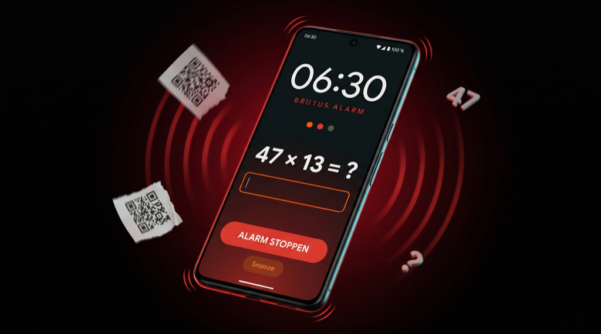

# Brutus

<p align="center">
  
</p>

[](https://developer.android.com)
[](https://kotlinlang.org)
[](https://developer.android.com/jetpack/compose)
[](https://developer.android.com/about/versions/oreo)
[](LICENSE)
[](https://github.com/pepperonas/brutus/releases/latest)
[](https://gradle.org)
[](https://developer.android.com/build)
[](https://developer.android.com/training/data-storage/room)
[](https://developer.android.com/training/camerax)
[](https://developers.google.com/ml-kit/vision/barcode-scanning)
[](https://github.com/zxing/zxing)
[](https://m3.material.io)
[](https://apilevels.com)
[](https://apilevels.com)
[](http://makeapullrequest.com)

> **The alarm clock that makes sure you actually wake up.**

Brutus is an Android alarm clock designed for heavy sleepers. It forces you to complete a configurable challenge — or a chain of challenges — before the alarm stops. No cheating, no auto-dismissing, no snoozing your way back to sleep.

---

## Table of Contents

- [Why Brutus?](#why-brutus)
- [Features](#features)
  - [Combinable wake-up challenges](#combinable-wake-up-challenges)
  - [Six brutal alarm sounds](#six-brutal-alarm-sounds)
  - [Global QR code](#global-qr-code)
  - [Slide-to-snooze gesture](#slide-to-snooze-gesture)
  - [Test mode](#test-mode)
  - [Scheduling](#scheduling)
  - [Lock-screen overlay](#lock-screen-overlay)
  - [Reliability](#reliability)
- [Install](#install)
- [Permissions](#permissions)
- [Build from source](#build-from-source)
- [Release signing](#release-signing)
- [Tech stack](#tech-stack)
- [Project structure](#project-structure)
- [How it works](#how-it-works)
- [Design philosophy](#design-philosophy)
- [Troubleshooting](#troubleshooting)
- [Roadmap](#roadmap)
- [Developer](#developer)
- [Donate](#donate)
- [License](#license)

---

## Why Brutus?

Stock Android alarms are polite. They ring, you tap _Dismiss_ with your eyes closed, and you're back asleep in seconds. Brutus breaks that loop on purpose.

- **No dismiss button up front** — the big "Stop" button only appears after you've completed every challenge you selected for that alarm
- **No silent mode escape** — Brutus overrides `STREAM_ALARM` to maximum and ignores Do Not Disturb via `USAGE_ALARM` audio attributes
- **No snoozing without effort** — the snooze button is a slide-to-unlock gesture, not a tap
- **No workarounds after power loss** — alarms are persisted in Room and re-registered on boot via a `BOOT_COMPLETED` receiver
- **No cheating with a printed screenshot of your QR code in bed** — you can put the QR far from your bed (like the bathroom mirror) and you must physically walk there to scan it

---

## Features

### Combinable wake-up challenges

Three independent challenge types. Enable one, two, or all three per alarm. Brutus runs them in sequence — you have to complete every one of them before the "Stop alarm" button appears.

| Mode | Description | Configurable |
|------|-------------|--------------|
| **Math** | Solve randomly generated problems (multiplication, addition, subtraction) with numeric answers | Count: **1–10 problems** (default 3) |
| **Shake** | Shake the phone with a circular progress ring visualizing how many shakes are left | Count: **10–100 shakes**, step 5 (default 30) |
| **QR scan** | Scan a specific QR code using ML Kit Barcode Scanning via CameraX | Uses the global QR code — see below |

Combination examples:
- **Easy**: Math (3 problems) only
- **Medium**: Math (5) + Shake (50)
- **Brutus Mode**: Shake (100) → Math (10) → QR scan across the house

### Alarm sounds

Every synthesized sound is generated on-device in real time using `AudioTrack` with `USAGE_ALARM` and `CONTENT_TYPE_SONIFICATION` attributes. No external audio assets, tiny APK impact, seamless looping.

| Sound | Character | Signal |
|-------|-----------|--------|
| **Stumm** | No audio — useful for rehearsing wake modes quietly | — |
| **System-Alarm** | Android default alarm (fallback) | `RingtoneManager.TYPE_ALARM` |
| **Klaxon** | Pulsing two-tone alarm | 600/900 Hz square wave, 300 ms each |
| **Sirene** | Sweeping siren | 400 → 1200 Hz sine sweep, 2 s cycle |
| **Nuclear Alert** | Rapid sharp beeping | 1 kHz square, 100 ms on / 100 ms off |
| **Durchdringend** | Piercing continuous beep | 3.5 kHz square wave with 8 Hz pulse — the most annoying one by design |

Choosing **Stumm** skips the audio path entirely; vibration still runs so the alarm is noticeable if you need it.

Sound preview works directly inside the edit dialog — tap a chip to hear it, tap _Stop preview_ when you're done.

### Global QR code

Brutus generates **one unique QR code** per installation, stored once in `SharedPreferences`, valid for every alarm forever. You never need to regenerate it. Workflow:

1. Create any alarm with the QR challenge enabled
2. The QR code is displayed inside the edit dialog
3. Tap **Save as PNG** — writes a 1024×1024 PNG to `Pictures/Brutus/` via MediaStore (Android 10+) or legacy storage (Android 8–9, with permission). The file is visible in any gallery app
4. Tap **Share** — sends the PNG through the Android share sheet (Gmail, WhatsApp, Bluetooth, etc.) via FileProvider
5. Print it, tape it to your bathroom mirror / fridge / front door — the farther from bed, the better

The code format is `brutus:{UUIDv4}`, ~43 characters. Any ML Kit-compatible QR scanner can read it, but only Brutus's own scanner verifies the match.

### Slide-to-snooze gesture

Snoozing is available during every phase of the alarm (including while a challenge is running) — but only by swiping an orange thumb horizontally across a track past the 85% threshold. A tap does nothing. Features:

- Animated gradient fill behind the thumb grows with drag progress
- Pulsing _"Zum Snoozen wischen"_ hint with a drifting chevron icon, fades out as you drag
- Springs back on incomplete swipe (damping 0.55)
- Snaps to the end on successful trigger, then fires the snooze
- Snooze duration configurable per alarm: **Off, 2, 5, 10, or 15 minutes** (default 5). Set to _Off_ to hide the snooze button entirely on the alarm screen — no escape except finishing the challenge

### Test mode

Every edit dialog has a **Test wake modes now** button. It opens the full alarm screen with your chosen sound and challenge chain — but without registering a real alarm, without max-volume override, and without lock-screen flags. Finish the test or just back out. Useful for:

- Checking how many math problems actually feels right
- Calibrating shake threshold to your phone's accelerometer
- Confirming you can scan your printed QR in realistic lighting
- Auditioning alarm sounds in context

### Scheduling

- **Exact alarm time** via `AlarmManager.setAlarmClock()` — shown in system status bar, works in Doze, survives battery optimization
- **Per-weekday repeat** — bitmask, Mon/Tue/Wed/Thu/Fri/Sat/Sun independently selectable
- **One-shot mode** — no days selected means fire once, then disable
- **Automatic re-scheduling** after the alarm fires (for repeating alarms)
- **Boot receiver** re-registers every enabled alarm after device restart or quick boot (`LOCKED_BOOT_COMPLETED`)

### Lock-screen overlay

The firing alarm presents a full-screen activity **over** the lock screen:

- `showWhenLocked = true` / `turnScreenOn = true` / `FLAG_KEEP_SCREEN_ON`
- `KeyguardManager.requestDismissKeyguard()` to skip PIN entry
- Full-screen notification with `CATEGORY_ALARM` and `setFullScreenIntent()`
- Large centered digital clock ticking in real time
- "BRUTUS ALARM" banner with animated progress dots for multi-challenge sequences
- Back button is intentionally blocked during the challenge
- Excluded from recent apps (`excludeFromRecents`)

### Reliability

| Concern | Mechanism |
|---------|-----------|
| Keeping audio playing with screen off | Foreground service with `mediaPlayback` type + `PARTIAL_WAKE_LOCK` (10 min timeout) |
| Surviving silent / DND | `STREAM_ALARM` with maximum volume set at start, restored when dismissed |
| Surviving reboot | Room persistence + `BOOT_COMPLETED` / `LOCKED_BOOT_COMPLETED` receiver |
| Surviving app kill | `START_STICKY` service, alarm is re-scheduled before firing |
| Preventing accidental snooze | Slide-to-snooze gesture with 85% drag threshold |

---

## Install

### Pre-built APK (recommended)

Grab the latest signed APK from the [Releases](https://github.com/pepperonas/brutus/releases/latest) page:

```
https://github.com/pepperonas/brutus/releases/latest
```

1. Download `brutus-v*.apk` on your Android device
2. Open the file — Android will prompt to allow install from this source if not already enabled
3. Tap **Install**

The APK is signed with a permanent keystore (`CN=Brutus, O=Pepperonas`, RSA 4096, 10,000-day validity). Future updates install cleanly over this one.

### Samsung note

Samsung's One UI by default revokes `SCHEDULE_EXACT_ALARM` for third-party apps. If your alarm doesn't fire at the exact minute:

**Settings → Apps → Brutus → Alarms & reminders → Allow**

---

## Permissions

| Permission | Purpose | When granted |
|-----------|---------|---------------|
| `SCHEDULE_EXACT_ALARM` / `USE_EXACT_ALARM` | Precise alarm timing via `setAlarmClock()` | Install time (API 33+: settings toggle) |
| `POST_NOTIFICATIONS` | Foreground service notification | Runtime, first app launch (API 33+) |
| `WAKE_LOCK` | Keep CPU awake during alarm playback | Install time |
| `RECEIVE_BOOT_COMPLETED` | Re-register alarms after reboot | Install time |
| `CAMERA` | QR code scanning challenge | Runtime, when the alarm fires and QR challenge is active |
| `VIBRATE` | Vibration pattern during alarm | Install time |
| `USE_FULL_SCREEN_INTENT` | Lock-screen alarm overlay | Install time |
| `FOREGROUND_SERVICE` / `FOREGROUND_SERVICE_MEDIA_PLAYBACK` | Alarm playback service | Install time |
| `WRITE_EXTERNAL_STORAGE` (API ≤ 28 only) | Save QR PNG on legacy Android | Runtime, when saving QR |

No internet permission is requested. Brutus is fully offline.

---

## Build from source

### Prerequisites

- **JDK 17** (Temurin, Homebrew OpenJDK, or Android Studio's bundled JBR)
- **Android SDK** with Platform 35 and Build-Tools 35.0.0+
- **Gradle 8.11+** (the included wrapper pulls it automatically)

### Clone and build debug

```bash
git clone https://github.com/pepperonas/brutus.git
cd brutus

# Create local.properties with your SDK path (first build only)
echo "sdk.dir=$HOME/Library/Android/sdk" > local.properties

# Build and install debug APK on a connected device
./gradlew installDebug
```

### Build release APK

Requires the signing keystore — see the next section.

```bash
./gradlew assembleRelease
# Output: app/build/outputs/apk/release/app-release.apk
```

### Run on device

```bash
adb install -r app/build/outputs/apk/debug/app-debug.apk
adb shell monkey -p com.pepperonas.brutus -c android.intent.category.LAUNCHER 1
```

---

## Release signing

Release builds are signed using a keystore stored outside the repo. The Gradle config reads signing credentials from either `local.properties` or environment variables — whichever is present.

### Local builds

Add to `local.properties` (already in `.gitignore`):

```properties
brutus.storeFile=/absolute/path/to/brutus-release.jks
brutus.storePassword=your_store_password
brutus.keyAlias=brutus
brutus.keyPassword=your_key_password
```

### CI / GitHub Actions

Set these repository secrets, then expose them as env vars in the workflow:

| Secret | Maps to |
|--------|---------|
| `RELEASE_STORE_FILE` | path to the decoded keystore file |
| `RELEASE_STORE_PASSWORD` | store password |
| `RELEASE_KEY_ALIAS` | key alias (`brutus`) |
| `RELEASE_KEY_PASSWORD` | key password |

The keystore itself is typically base64-encoded into a secret, decoded to disk at workflow start.

### Creating a new keystore (for forks)

```bash
keytool -genkeypair -v \
  -keystore brutus-release.jks \
  -keyalg RSA -keysize 4096 \
  -validity 10000 \
  -alias brutus \
  -dname "CN=Brutus, OU=YourOrg, O=YourOrg, L=City, ST=State, C=DE"
```

---

## Tech stack

| Layer | Technology |
|-------|-----------|
| Language | Kotlin 2.1.0 |
| UI | Jetpack Compose + Material 3 + Material Icons Extended |
| Architecture | MVVM (AndroidViewModel + Repository) |
| Database | Room 2.6.1 with KSP code generation |
| Scheduling | `AlarmManager.setAlarmClock()` |
| Background | Foreground Service (media playback type) + `PARTIAL_WAKE_LOCK` |
| Audio | `AudioTrack` (synthesized) + `MediaPlayer` (system ringtone) |
| Camera | CameraX 1.4.1 |
| Barcode scanning | Google ML Kit Barcode Scanning 17.3.0 |
| QR generation | ZXing Core 3.5.3 |
| Gradle | 8.11.1 with AGP 8.7.3 |
| Min / Target SDK | 26 (Android 8.0) / 35 (Android 15) |

No Hilt, no Koin, no Dagger — manual DI via the Application class. No Retrofit, no coroutines channels, no Flow operators beyond `stateIn`. The codebase is small on purpose.

---

## Project structure

```
app/src/main/java/com/pepperonas/brutus/
├── MainActivity.kt                  Entry screen, hosts the alarm list
├── AlarmActivity.kt                 Lock-screen overlay activity for the firing alarm
├── TestAlarmActivity.kt             Preview activity for "test wake modes"
├── BrutusApplication.kt             App init, notification channels
├── receiver/
│   ├── AlarmReceiver.kt             BroadcastReceiver for the AlarmManager trigger
│   └── BootReceiver.kt              Re-schedules alarms on BOOT_COMPLETED
├── service/
│   └── AlarmService.kt              Foreground service — audio, wake lock, vibration
├── scheduler/
│   └── AlarmScheduler.kt            AlarmManager wrapper with next-occurrence math
├── data/
│   ├── AlarmEntity.kt               Room entity — time, days bitmask, challenge flags, counts
│   ├── AlarmDao.kt                  DAO with Flow-based reactive queries
│   ├── AlarmDatabase.kt             Room database singleton (v4)
│   └── AlarmRepository.kt           Single data access abstraction
├── viewmodel/
│   └── AlarmViewModel.kt            State container with StateFlow of alarms
├── ui/
│   ├── theme/
│   │   ├── Color.kt                 Dark palette with BrutusRed + BrutusRedBright
│   │   ├── Type.kt                  Typography (M3 defaults for TimePicker clarity)
│   │   └── Theme.kt                 Dark-only color scheme
│   ├── screens/
│   │   ├── AlarmListScreen.kt       Main screen: alarm cards, FAB, edit trigger
│   │   └── AlarmEditDialog.kt       Modal bottom sheet: time, days, sound, challenges, counts, QR, snooze, test
│   └── alarm/
│       ├── AlarmScreen.kt           Full-screen overlay with clock + challenge carousel
│       ├── MathChallenge.kt         Numeric input + random multiplication/addition/subtraction
│       ├── ShakeChallenge.kt        Accelerometer listener + circular progress ring
│       ├── QrChallenge.kt           CameraX preview + ML Kit barcode analyzer
│       └── SwipeToSnoozeButton.kt   Custom gesture composable with spring-back animation
└── util/
    ├── AlarmSound.kt                Enum of available alarm sounds
    ├── AlarmSoundGenerator.kt       Procedural PCM synthesis for all non-system sounds
    ├── ChallengeFlags.kt            Bitmask helpers for challenge combinations
    ├── GlobalQrStore.kt             SharedPreferences-backed global QR persistence
    ├── QrGenerator.kt               ZXing wrapper + save + share helpers
    └── SoundPreviewPlayer.kt        AudioTrack wrapper for in-dialog previews
```

---

## How it works

### Alarm firing timeline

```
T − ∞     User creates alarm   →   AlarmScheduler.schedule()
                                     ↓
                            AlarmManager.setAlarmClock(triggerTime)
                                     ↓
T  0s     AlarmReceiver.onReceive()
                                     ↓
            startForegroundService(AlarmService, ACTION_START)
                                     ↓
T + 50ms  AlarmService.startAlarm()
            • Acquire PARTIAL_WAKE_LOCK (10 min)
            • Set STREAM_ALARM volume → max (save previous)
            • Start vibration pattern
            • Load alarm entity from Room (IO thread)
            • Play sound via AudioTrack (synthesized) OR MediaPlayer (system)
            • Launch AlarmActivity (FLAG_ACTIVITY_NEW_TASK)
            • Re-schedule for next occurrence if repeating, else disable
                                     ↓
T + 100ms AlarmActivity renders
            • setShowWhenLocked / setTurnScreenOn / dismissKeyguard
            • AlarmScreen composable reads challengeFlags, math/shake counts, QR
            • Iterates active challenges in sequence
                                     ↓
          User completes all challenges
                                     ↓
          AlarmActivity.stopAlarm()
            • Intent(AlarmService, ACTION_STOP)
            • finishAndRemoveTask()
                                     ↓
          AlarmService.stopAlarm()
            • Stop MediaPlayer/AudioTrack, cancel vibration
            • Restore original STREAM_ALARM volume
            • Release wake lock
            • stopForeground + stopSelf
```

### Snooze path

The same flow, but after the user slide-triggers the snooze button:

- `AlarmActivity` sends `ACTION_SNOOZE` with the alarm id to the service
- Service calls `AlarmScheduler.scheduleSnooze()` which registers a fresh `setAlarmClock()` for `now + snoozeDuration minutes`
- Current alarm is fully torn down
- The snooze fires exactly like a regular alarm — same challenges, same sound

### Boot recovery

`BootReceiver` listens for both `ACTION_BOOT_COMPLETED` and `ACTION_LOCKED_BOOT_COMPLETED` (`directBootAware = true`). It queries all enabled alarms from Room and calls `AlarmScheduler.schedule()` on each.

---

## Design philosophy

- **Every decision favors waking the user up over UX politeness.** If you need a polite alarm, use the system clock.
- **Challenges are configurable because brains are different.** Some people need math; others just need physical movement. Some need both.
- **No account, no network, no tracking.** Brutus never touches the internet.
- **APK size matters less than reliability.** ML Kit adds ~20 MB; it's worth it for the QR mode.
- **Procedural audio beats licensed samples.** Synthesized sounds mean no copyright issues, no asset loading, no file cache — and the sounds can be tuned to be as nasty as needed.
- **Destructive DB migration is acceptable during pre-1.0 development.** Once Brutus hits a real release cadence, proper Room migrations will replace the current fallback.

---

## Troubleshooting

### Alarm doesn't fire at the exact time
Check that _Alarms & reminders_ is allowed for Brutus in system settings. On Samsung, Xiaomi, and Huawei devices this is frequently denied by default. Also disable battery optimization for Brutus (_Settings → Apps → Brutus → Battery → Unrestricted_).

### Alarm rings but no sound
Confirm `STREAM_ALARM` is not muted at the system level (some phones have a dedicated hardware mute for alarms). Try switching the alarm sound to _System_ — if that works, one of the synthesized sounds hit a device-specific AudioTrack bug; please open an issue.

### QR scan never triggers
Make sure the printed QR has good lighting and enough contrast. Test mode with the phone camera in realistic conditions first. The scanner only accepts an exact string match — if you regenerate the QR globally or re-install the app, the old printed code becomes invalid.

### Notification persists after dismissing
Force-stop Brutus once via system settings. This is typically an edge case when the service didn't finish cleanly after the alarm was killed by aggressive battery management.

### App crashes after update
Pre-1.0 releases use destructive Room migrations. Any alarm data from an older version is dropped on schema change. Create your alarms again.

---

## Roadmap

Planned, no specific timeline:

- [ ] Proper Room migrations (remove `fallbackToDestructiveMigration`)
- [ ] Configurable shake sensitivity
- [ ] Math difficulty presets (easy / hard / brutal)
- [ ] Per-alarm sound override at runtime
- [ ] Multi-QR support (different codes for different alarms)
- [ ] Widget: next upcoming alarm
- [ ] Wear OS companion
- [ ] Localization beyond German
- [ ] R8 / ProGuard rules for size-optimized release builds
- [ ] GitHub Actions workflow for automated release signing + APK upload

Contributions welcome on any of these — open an issue first to coordinate.

---

## Developer

**Martin Pfeffer** · [celox.io](https://celox.io)

GitHub: [@pepperonas](https://github.com/pepperonas) · Email: [martin.pfeffer@celox.io](mailto:martin.pfeffer@celox.io)

Brutus is part of a family of small, focused Android apps published under [pepperonas](https://github.com/pepperonas) — all built solo, all offline-first, all opinionated.

---

## Donate

If Brutus actually gets you out of bed in the morning, consider buying me a coffee (or a louder alarm) via **PayPal**:

[](https://www.paypal.com/paypalme/martinpfeffer)

Donations are never expected — the app is and will stay free, ad-free, and offline. Every contribution funds more brutal alarm experiments.

---

## License

```
MIT License

Copyright (c) 2026 pepperonas

Permission is hereby granted, free of charge, to any person obtaining a copy
of this software and associated documentation files (the "Software"), to deal
in the Software without restriction, including without limitation the rights
to use, copy, modify, merge, publish, distribute, sublicense, and/or sell
copies of the Software, and to permit persons to whom the Software is
furnished to do so, subject to the following conditions:

The above copyright notice and this permission notice shall be included in all
copies or substantial portions of the Software.

THE SOFTWARE IS PROVIDED "AS IS", WITHOUT WARRANTY OF ANY KIND, EXPRESS OR
IMPLIED, INCLUDING BUT NOT LIMITED TO THE WARRANTIES OF MERCHANTABILITY,
FITNESS FOR A PARTICULAR PURPOSE AND NONINFRINGEMENT. IN NO EVENT SHALL THE
AUTHORS OR COPYRIGHT HOLDERS BE LIABLE FOR ANY CLAIM, DAMAGES OR OTHER
LIABILITY, WHETHER IN AN ACTION OF CONTRACT, TORT OR OTHERWISE, ARISING FROM,
OUT OF OR IN CONNECTION WITH THE SOFTWARE OR THE USE OR OTHER DEALINGS IN THE
SOFTWARE.
```
